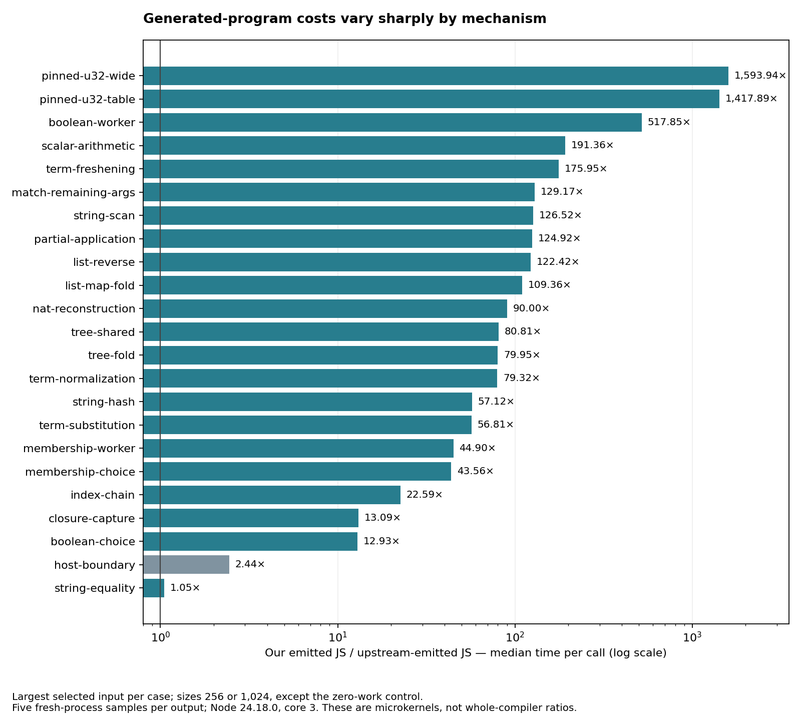
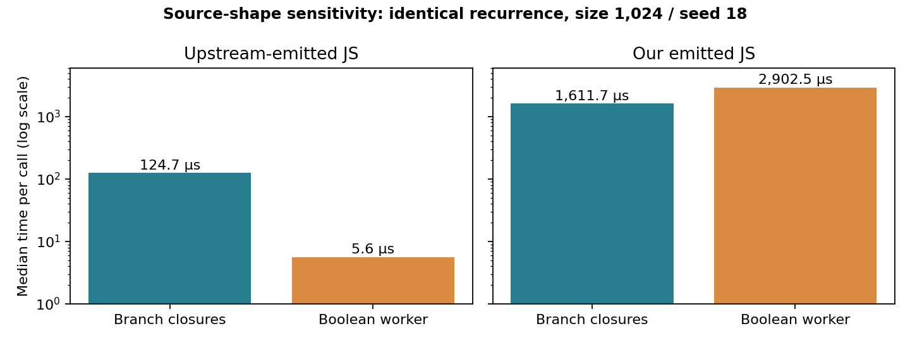

# Phase25: generated code explains the performance gap

We built and ran a paired generated-program investigation without changing the
compiler. The strongest findings are concrete backend work: primitive numeric
patterns expand into bit-list construction and large matcher trees; otherwise
saturated calls are split across matchers; arithmetic and recursion remain generic
runtime operations where upstream emits direct arithmetic and loops.

The new loop can reproduce a selected paired result in **5.37 seconds**, including
output checks, calibration and ten fresh timing processes. The complete cached
45-point timing sweep used **171.69 seconds** of child-process wall time. This
supplies a useful first gate before a costly self-emitted compiler build.

No compiler optimization is promoted here. The installed Phase24 release and its
15,776 canonical Bend lines are unchanged. Its historical approximately3× ordinary
checking ratio is a different metric from the emitted-program measurements below.

## What was completed

The [design](../../design/phase25/generated-code-analysis.md) was committed and
pushed before acquisition. Its four stages were completed in order: freeze/paired
corpus, structural census, clean execution plus separate diagnostics, and review.

| Evidence | Fresh result |
|---|---|
| Corpus | 23 Bend programs, 46 checked emitted JS libraries |
| Independent scalar oracles | 127 input/result points, exact on both outputs |
| Clean execution comparison | 45 benchmark points, five fresh processes per output, 450 successful samples |
| Structural analysis | Full Acorn ASTs for all46 modules; paired source hashes agree |
| CPU/allocation/counters | Nine selected kernels, 18/18 healthy final diagnostic processes |
| Counter controls | Seven selfhost and three upstream known-operation controls, repeated successfully on the selected copies |
| V8 traces | Eight successful processes; original summary-parser failures retained and reconciled |
| Focused command | Fresh numeric-pattern replay, ten successful timing samples, 5.37s end to end |

The corpus includes mechanism analogues and two byte-identical pinned fixture
prefixes with appended runtime-input wrappers. The term examples are small
first-order models, not complete compiler helpers or dependent graph conversion.
Some helpers are explicitly `@unsafe`: successful type checking is not a
termination or proof-kernel claim. [Corpus and failed fixture attempts](corpus-notes.md).

## Controlled execution results

Each timed operation calls an emitted `bench(size, seed) -> U32`, constructs its
documented input, performs the work, consumes its scalar result and checks it
against an independent expected value. There is no compilation inside this span.
The larger selected input per case is shown; [all45 points and raw ranges](timing-summary.json)
and [CSV](timing.csv) retain both inputs.

| Selected workload | Size / seed | Upstream output, µs/call | Our output, µs/call | Our / upstream |
|---|---:|---:|---:|---:|
| String equality | 1024 /18 | 2,136.41 | 2,236.43 | 1.05× |
| Index-chain analogue | 256 /18 | 53.29 | 1,204.07 | 22.59× |
| Term-substitution analogue | 256 /18 | 70.69 | 4,015.89 | 56.81× |
| Match followed by arguments | 256 /18 | 6.48 | 837.52 | 129.17× |
| Scalar arithmetic recurrence | 1024 /18 | 9.66 | 1,847.88 | 191.36× |
| Boolean-worker recurrence | 1024 /18 | 5.60 | 2,902.46 | 517.85× |
| Dense U32 patterns | 256 /18 | 1.93 | 2,737.44 | 1,417.89× |
| Wide U32 patterns | 1024 /18 | 3.64 | 5,801.53 | 1,593.94× |



These are deliberately discriminating small programs, not a representative
application-weighted average. Do not call the compiler1,594× slower or predict H
throughput from this table. Across both numeric-pattern inputs, observed ratios
range1,418–1,761×; even the conservative observed-sample extrema keep those cases
above1,363×. Five samples are a controlled screen, not a universal confidence bound.

Node 24.18.0, CPU3 affinity, a 4 MiB stack and 1 GiB heap are identical on both sides.
Every fresh process warms for at least 100 ms and eight calls. Calibration freezes
side-specific repetition counts to avoid an extremely short faster-side sample;
ratios use time per call. Actual measured blocks span54.03–227.39ms. All samples,
imports, resource flags, peak RSS, checksums and calibrations are retained.
The order alternates serially; no other compiler or profiler work was scheduled
on CPU3 during timing. Static analysis ran on CPU6. Other host activity cannot
be ruled out.

The zero-work public-call control is approximately 54 ns upstream and 132 ns selfhost
(2.44×). That boundary cannot explain the much larger absolute kernel costs; its
separately measured time is not subtracted. Module import is measured separately:
median across retained samples0.80ms upstream versus19.34ms selfhost. These import
observations include each emitter's actual ordinary-library initialization.

Size and seed change together between the two selected points. Membership changes
from a miss to a hit, and some string kernels change Unicode/ASCII paths. Therefore
this is input diversity, not a controlled size-scaling experiment. Wide-pattern
timings exercise its default arm; special wide arms have correctness observations.
The [independent measurement review](measurement-review.md) verifies all450 raw
samples, module/input hashes, normalization, checksums and non-overlap.

## Main findings

### 1. Native U32 patterns become33-node temporary bit lists

The current runtime's `project("U32", x)` calls `word(x)`, constructing one
`WNil` and 32 `WCon` values before generic matching. Exact counters establish:

- Dense-pattern benchmark: 257 scalar matches → **8,481 constructor calls**.
- Wide-pattern benchmark: 1,024 scalar matches → **33,792 constructor calls**.

Upstream emits a 17-entry table for the dense pattern and direct numeric decisions
for wide keys. The candidate's `pop` definition occupies **65,562 bytes**, including
958 matcher and 464 `fn` syntax sites. Upstream's corresponding function is 60 bytes
plus a 68-byte table. The candidate's wide `key` is 12,019 bytes versus 235 bytes.
These are owner-specific generated sizes, not whole-file size comparisons.

This mechanism is corroborated by static output, exact operations and sampled
allocations. It is the most isolated first optimization experiment: recognize
fully typed native U32 decision trees and emit numeric decisions, preserving the
generic path for unsupported patterns. The measured whole-kernel ratio includes
other costs, so it is not the promised gain from that change alone.

### 2. Matches break saturated calls into generic runtime steps

Our scalar recurrence emits this staged form:

```js
jump(call(get(G, "spin"), [rest]), [nextAccumulator])
```

Upstream carries both arguments through the match and emits a `for (;;)` loop with
direct arithmetic. The three-argument traversal similarly becomes nested calls
in our output. Runtime counters per complete benchmark call include:

| Kernel | `apply` calls / argument-copy arrays | Partial applications | Function records | Tail messages |
|---|---:|---:|---:|---:|
| Scalar, size1024 | 9,220 | 1,024 | 3,073 | 3,073 |
| Match/arguments, size256 | 3,591 | 769 | 1,795 | 1,793 |
| Boolean worker, size1024 | 10,756 | 1,024 | 4,609 | 4,609 |

Every `apply` here also copies an argument array. A matcher entry itself is not
automatically an underapplication; counters distinguish exact, partial and
overapplied paths. Across the nine selected candidate profiles, runtime-prefix
frames receive73–87% of sampled CPU. Inlined work can be attributed to its caller,
so those shares are evidence of hot machinery, not an Amdahl speedup ceiling.

Known saturated private workers and direct tail cycles are the broader next
direction. Primitive arithmetic inlining and Nat representation are separate
factors: our runtime uses BigInt Nat where upstream uses checked JS numbers. A
single combined rewrite would obscure which change helped.

### 3. A useful bootstrap source optimization can reverse under our emitter

The two Boolean kernels implement the same tested recurrence. At size 1024 / seed 18:

- Upstream: branch closures 124.68 µs → Boolean worker 5.60 µs, **22.24× faster**.
- Our emitter: branch closures 1,611.69 µs → worker 2,902.46 µs, **1.80× slower**.



Upstream lowers the worker pair to a loop/state machine. Our output retains
matcher/call chains, increasing function-record and dispatch counts. This explains
why optimizing the source of an upstream-built B1 does not automatically improve
self-emitted H. Future source optimizations should run through both emitters in
this fast loop before we infer benefits for self-hosting.

### 4. Preserve successful primitives; fewer closures is not a universal answer

String equality is only1.05–1.15× slower across its selected points despite many
generic calls. Our exact native-string primitive offsets dispatch overhead;
upstream traverses comparison/reconstruction helpers. Candidate sampled allocations
are lower for this particular workload. A blanket replacement of our primitive
choices with upstream behavior would discard a useful result.

The scalar candidate function is also shorter than upstream's loop while being
much slower. Static bytes or closure counts alone are poor optimization scores.
The full [dynamic findings](dynamic-findings.md) keep separate operation counts,
sampled allocated bytes, retained-memory limitations and constructor-forcing costs.

### 5. Repeated deoptimization is not supported as the main explanation here

The selected steady V8 trace windows show **zero deoptimizations in all four
candidate cases**. Upstream's five observed steady-window deoptimizations belong
to the tracing harness function `run`. This bounded observation does not prove
ideal JIT behavior; it favors reducing the generic work the emitted code performs
over treating recurrent deoptimization as the leading explanation for these gaps.
Raw GC counts have different amounts of work behind them and are not compared as
allocation ratios. [Reconciled trace summary](trace-summary.json).

### 6. Separate cold support size from hot workload code

The exact copied runtime is42,878bytes in our modules and3,546bytes upstream.
Our ordinary libraries also contain48 corpus-common emitted registrations totaling
14,763bytes each. Their identical repetitions are reported separately. Libraries
have different export policies: our wrapper exposes all `G` entries, including
support that upstream excludes from ordinary module exports. This matters for
import/footprint, but those bytes are not repeatedly counted as new workload logic.
The host-boundary case's residual program statements are only78bytes versus56.
[Structural census, source ranges, recurring shapes and limits](structure-notes.md).

## Decision and next experiments

| Priority | Experiment | Evidence it targets | Correctness obligation / stop condition |
|---|---|---|---|
| 1 | Direct native U32 pattern decisions |33 temporary nodes per match; dense/wide expanded matcher trees | Preserve unsigned/full-width semantics, identity, branch/default order and demand; generic fallback; reject on any nearby-pattern mismatch |
| 2 | Saturated private workers through matches, then tail loops | Thousands of generic dispatches/partials; Boolean source rewrite reverses | Preserve public partial/overapplication, captures, argument/error order and stack behavior; measure one family before generalizing |
| 3 | Primitive arithmetic inlining as its own ablation | Generic U32 calls inside otherwise simple loops | Match exact overflow, shift and error rules; avoid shadowed/user constructors |
| 4 | Constructor continuation/forcing reduction | Hot `force` and build-message creation in term/list analogues | Preserve deferred demand and deep-stack handling; do not eagerly force arbitrary fields |
| 5 | Library support pruning | Large common cold prefix and initialization | Separate public export compatibility from ordinary program reachability; no warmed-loop speed promise |

Numeric-pattern lowering is the narrowest proof of this method. Known workers are
more directly relevant to general compiler term/list traversal. Their eventual
effect on full H must be measured, not estimated by multiplying microkernel gains.
No native C/LLVM/GPU study or new fixed point was needed for this first JS phase.

## The usable iteration loop

The complete retained emission acquisition cost54.06s of child-process wall and
its independent execution checks5.94s. These are descriptive acquisition costs,
not a controlled compiler-throughput comparison. Reusing the emitted artifacts,
the450-sample sweep takes171.69s; ten-process paired points take2.92–6.67s
(median3.67s), excluding initial calibration.

The new `compare.py` performs exact output checks, calibration and a fresh
ten-sample comparison for one pair of emitted modules. Its separate numeric-table
replay completed in5.37s, retaining a1,421.14× ratio consistent with the original
screen. It does not build or validate a compiler; use the checked development
workflow to produce an identified candidate, then emit the same small source.
See [reproduction and focused commands](README.md) and the
[compiler guide](../../docs/BEND-IN-BEND.md#analyzing-emitted-program-performance).

## Failures, review and preservation

All failed fixture-construction attempts remain preserved (including affine
capture errors and a constructor-name collision). The first structural census
omitted the multi-constructor `matcher` helper from its vocabulary; its tool and
report are retained, and the corrected full census supplies the final numbers.

The first diagnostic launcher returned exit2 because an imported tool mistook
`node -e` arguments for direct CLI invocation. Its self-reported passes were
invalid as healthy process outcomes. We retained it, fixed the launcher, required
both exit0 and report success, and reran all18 diagnostics. The clean timing CLIs
were unaffected. Two V8 trace summaries initially assumed JSON was stdout's last
line; asynchronous GC messages disproved that assumption. All eight trace
processes exited0, and the exact saved logs were reconciled without rewriting the
original failed summaries or rerunning selected survivors.

The measurement reviewer independently audited the root-owned timing acquisition;
the reviewer authored the corpus, which is disclosed. A second reviewer checked
dynamic attribution and caught the launcher defect. All input identities and the
103 unrelated preexisting paths are checked at closure. No source, runtime, Base,
installed API or checked-parent bytes were changed by this phase.

The [evidence index](evidence/README.md) supplies compressed raw artifacts,
per-file hashes and recovery verification. It includes every emitted library,
sample, profile, counter guard, control, calibration and failed diagnostic attempt.
The raw structural census has its own verified archive. Summaries and figures are
tracked directly. Remaining boundaries are explicit: selected JS microkernels,
finite scalar observations, no full current H, no new broad backend acquisition,
and no claim of universal correctness or whole-compiler speedup.
