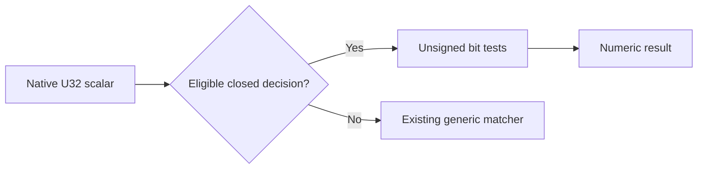
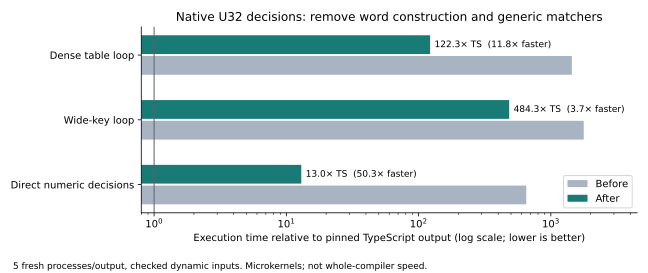

# Phase26: direct U32 decisions, measured and installed

The JavaScript emitter now lowers eligible native U32 decision functions directly
to unsigned bit tests. The measured dense-table workload is **11.80× faster**,
the wide-key loop **3.66× faster**, and the direct numeric decision test **50.25×
faster** than the prior selfhost output. The change adds110 Bend lines and leaves
the runtime, frontend, native backend, Base and function calling convention intact.

These are generated-program gains. **No whole-compiler throughput or new H
speedup is established.** The real compiler escape component remains unchanged;
its String result lies outside this deliberately small first implementation.

[Design](../../design/phase26/direct-u32-decisions.md),
[frozen hypothesis](../../experiments/phase26/P26-001-direct-u32-decisions.md),
[reproduction](README.md), [machine-readable results](results.json),
[independent review](u32-review.md).

## What changed and why

The old matcher projects a native U32 scalar to a linked Word, allocating32 WCon
values and one WNil. It then traverses that word through generic matcher, closure,
partial-application and trampoline machinery. Deep pattern trees also require
lifted factory definitions just to keep emitted JavaScript parseable.

The new [u32.bend](../../selfhost/src/back/js/u32.bend) recognizes checked,
top-level U32-to-U32 decision functions whose reachable leaves are closed numeric
literals. It follows the existing ordered matcher tree and emits unsigned bit
tests on the original number. Recognition happens before deep closure lifting,
so factories for the discarded tree disappear as well. It uses the existing
`fn(1, ...)` ABI. No replacement runtime or intermediate representation is added.

Native owner/constructor flags are required for U32, Word.Nil/WNil, Word.Con/WCon,
Bool/False/True and Word. An explicit Maybe result rejects unsupported shapes.
Captured values, used residual words, function/String/List results and arbitrary
calls keep the generic emitter. An8192-node preflight and a32-bit depth boundary
limit recognition; ignored bit binders are traversed once. See the
[implementation boundary](u32-analysis.md) for the argument and limitations.

## Controlled performance

Six cases, three emitted outputs and five fresh processes per output produced
**90 valid timing samples**. Node24.18.0, CPU3, stack4096KiB and heap1024MiB were
fixed. Each process warmed for at least100ms/eight calls; side-specific calibration
targeted150ms with a1M-call cap. Variant order rotated serially; compiler builds,
other agents' executions and diagnostics were stopped during timing. Every timed
call checked its independently expected scalar result. Raw timed blocks span
53.67–183.48ms. The full cached comparison took44.61s, about7.44s per three-output
case including checks/calibration and15 timing processes.

| Generated workload (size, seed) | TypeScript µs/call | Before µs/call | After µs/call | Speedup | After / TS |
| --- | ---: | ---: | ---: | ---: | ---: |
| Dense table loop (256,18) | 1.893 | 2730.264 | 231.448 | **11.80×** | 122.26× |
| Wide-key loop (1024,18) | 3.672 | 6515.504 | 1778.150 | **3.66×** | 484.26× |
| Direct numeric decisions (2147483648,18) | 0.0682 | 44.4566 | 0.8847 | **50.25×** | 12.97× |
| Scalar arithmetic (1024,18) | 9.656 | 1828.536 | 1840.918 | 0.993× | 190.66× |
| Actual compiler escaping (32,17) | 336.595 | 17942.361 | 17900.572 | 1.002× | 53.18× |
| Host boundary (0,17) | 0.0537 | 0.1347 | 0.1395 | 0.965× | 2.60× |

Numbers are medians, with all sample ranges in results.json; they are not general
confidence bounds. The arithmetic, escape and boundary controls have unchanged
program code after normalizing only embedded Base foreign-file paths for analysis.
The benchmark runs original emitted bytes, not normalized/transformed copies.
Old Base came from installed dist; the candidate attempt uses the identical Base
bytes in the pinned checkout. None of these kernels executes those foreign paths.
The wide-key timed input follows the default path; special-key correctness is
checked separately. No pure scaling law follows from these selected inputs.

## The predicted mechanism actually disappeared

Guarded runtime counters ran separately for10 calls per variant. The following
figures are **per complete benchmark call**, not per inner pattern match:

| Workload | Constructor calls before → after | apply calls before → after | Function records before → after |
| --- | ---: | ---: | ---: |
| Dense table loop | 8,481 → **0** | 6,338 → 1,541 | 5,309 → 512 |
| Wide-key loop | 33,792 → **0** | 17,926 → 9,223 | 12,801 → 4,098 |
| Direct numeric decisions | 66 → **0** | 139 → 6 | 133 → **0** |

These count exact named helper entries, not every JavaScript allocation. Each
instrumented copy passed the maintained counter controls and exact output checks.
The original runtime prefix matched byte-for-byte; no diagnostic image is installed.

AST analysis assigns the complete top-level definition, including its lifted
factories, to its owning global. Dense `pop` shrinks from65,562 to8,711 bytes
(−86.7%); wide `key` from12,019 to1,567 bytes (−87.0%). `pop` loses all958 matcher
sites and goes from464 `fn` sites to1; `key` loses176 matcher sites and goes from86
to1. The replacement still contains463/85 bit conditionals: it is intentionally
simpler than upstream's broader row/table optimizer. Static counts are not timings.

Across the Phase25 corpus,21 of23 modules are exactly unchanged after the disclosed
Base-path normalization. Only the two targeted numeric workloads change. The
complete extracted escaping helper is likewise unchanged after that normalization.

## Correctness and usable release

All required scoped gates passed:

- Genuine checked B1 bootstrap plus the maintained guarded equality profile;
  **36/36** standard focused observations agree exactly with pinned upstream.
- **15/15** selected upstream JavaScript execution fixtures agree exactly, including
  dense tables, bit-variable defaults, shared/structural words, F32 fallback,
  constructor matches, erasure and closure cases.
- The unchanged Phase25 corpus: **23 checked libraries,127 exact scalar points**.
- Seven new executable fixtures: **2,816 scalar checks per emitter**, plus four
  phase-specific refusal controls per emitter. A separate ignored-bit/prefix
  supplement adds468 checks per emitter. Cases cover exhaustive byte inputs,
  fixed full-width random inputs, unsigned boundaries, captures, multiple columns,
  partial/higher-order use, structural fallbacks and unselected divergence.
- Independent recognizer controls: **56 guard observations and780 executions**,
  including missing/non-native owners and constructors, open leaves, ordered
  Boolean priority and exact fuel boundaries. These use append-only diagnostic
  exports around unchanged candidate functions; they are distinct from the
  checked-source pipeline tests.
- Actual escaping component: five full-text edge cases and six scalar/full-output
  points pass for old, new and TypeScript emissions.

Counts overlap and must not be added into a claim of full backend conformance.
The broader Phase24 frontend3026+196 and backend81 observations are historical
evidence; they were not all rerun for this emitter-only change. No native/GPU
speed result or new self-hosted fixed point is claimed.

The checked derivative is installed and release lineage verifies. The ordinary
CLI runs the upstream bit-variable/default fixture and prints `2496 2397`.
Installed API:
`4c67ac041c41d1e9ba5984ea29985a46ff7ee90963cb8eb820a7c82d91e7f664`;
genuine checked parent:
`818f68caf88d83ed1b006330d6f6ef9c7f2ee2ddd6c7663d92c8f434b1eafa0d`;
canonical source:
`cfd868a738acbb2b1ce2281b1ca9bf5b91ce0560f623baf1baf391bb2a5f8042`.
Upstream remains018751270e800bc222a93dad7f257083ee53a5f7. Runtime, Base and guarded
profile6 are unchanged. The prior release is preserved in release history.

The supported semantic domain is checked native U32 scalar input. An adversarial
raw JS object supplied as a U32 could observe one coercion instead of32. The
library has no universal host-input validation contract, and this phase does not
claim arbitrary object/proxy equivalence or forged raw-book provenance safety.

## Complexity and next decision

Canonical source is now **15,886 physical /13,562 nonblank lines,61 modules,
1,718 definitions,640 laws and68 types**. Relative to Phase24: +110 physical
lines (+0.70%), +95 nonblank, +15 helpers, +1 module, no new datatype/runtime
representation. This improves generated-code complexity; it does not reduce the
compiler's own line count. [Source census](source-census.json) gives exact scope.

The main lesson repeats Phase25's pattern: eliminate the unnecessary
representation and dispatch work before asking the host optimizer to handle it.
Counter evidence explains the large gains. It also explains the remaining gap:
the wide loop still performs9,223 generic applications and allocates4,098 function
records per benchmark call. Replacing numeric matchers alone cannot remove that.

Next, test the [bounded call-lowering proposal](call-lowering-analysis.md): prebind
constructor fields into a selected partial arm while preserving its descriptor
and demand order. Keep it a separate ablation. Simply raising public call arity
is unsafe because it can evaluate later arguments before the matcher. Wider
numeric result support, primitive inlining and tail loops also remain separate
experiments. The compiler's four numeric-case helpers currently return String or
List, so none qualifies for this initial U32-result rule; do not promise an H gain.

## Failures, preservation and promotion

Source pilots retained two corrected expectations: native-looking user type names
are refused during upstream emission, and an invalid direct-constructor match
did not reach the intended refusal boundary. The first synthetic-guard harness
also failed because its helpers were not public exports; the successful version
exposes the unchanged bodies only in a diagnostic copy. These are harness/source
pilot failures, not hidden compiler counterexamples. Original attempts remain.
The initial closure audit also included an intentionally updated backend README;
the corrected audit checks canonical compiler inputs separately from documentation.

The evidence capsule and per-file recovery receipt preserve checked build inputs,
baseline copies, all control attempts, all90 timing samples, exact counters,
compressed AST data, release observations and the installed compiler identities.
Phase25 supplies the referenced old corpus artifacts under its own durable
capsule. The closure audit verifies the103 unrelated starting paths are unchanged.
See [evidence](evidence/README.md) for hashes and recovery.

Decision: **promote the restricted rule**. Correctness, mechanism, measurement and
promotion have separate evidence; a useful result does not broaden the rule's
semantic or performance claim.
