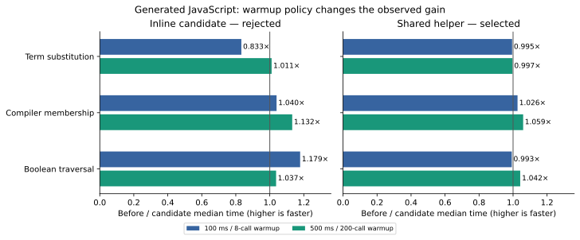

# Phase27: selected constructor arms with less dispatch

The selected shared-helper implementation improves the real compiler membership
component **1.026× in the short-window protocol and1.059× after longer warmup**.
The Boolean traversal improves1.042× after longer warmup. Selected short-window
list and arithmetic workloads improve about2–6%; substitution is essentially
unchanged. These are modest generated-program gains, **not a new measurement of
whole-compiler throughput or self-emitted H**.

The first inline implementation was not promoted: it caused a reproducible20%
short-window substitution penalty. Sharing the callback removed that penalty
in the follow-up without changing the recognized source shapes. Both variants,
all360 samples and the negative result remain preserved.

[Design](../../design/phase27/constructor-arm-prebinding.md),
[warmup amendment](../../design/phase27/longer-warmup.md),
[shared-helper amendment](../../design/phase27/shared-arm-runtime.md),
[reproduction](README.md), [raw summary](results.json),
[independent source review](arm-review.md),
[measurement audit](measurement-audit.md).

## Transformation and semantic boundary

The old selected constructor matcher creates an arm function, jumps to it with
projected fields, and allocates a partial function because more arguments remain.
The new rule constructs that same partial descriptor directly, removing the
intermediate function record, generic application and trampoline bounce.

[arm.bend](../../selfhost/src/back/js/arm.bend) requires a single remaining
constructor, a literal unlifted lambda arm, a complete live-field telescope and
positive field count smaller than the arm's leading lambda count. Unknown,
erased, lifted, eta-short, zero-field and exactly saturated shapes retain the
existing matcher. No workload name or performance-case exception is used.

The outer matcher keeps arity1. Returned partial functions keep their original
arity, anonymous code body/name, null environment, captures and copied bound
fields. Subsequent argument expressions and branch bodies remain delayed.
Merely raising matcher arity would violate this evaluation boundary.

The11-line `matcher1p` helper in
[runtime/js/core.mjs](../../selfhost/src/runtime/js/core.mjs) performs the original
projection and length read, then obtains the code closure. Unexpected projected
length uses the original generic fallback. After one field-vector slice, it
retains all three exact/partial/overapplication branches: a custom slice may
return a vector of a different length. Proxy/getter traces and code descriptor
metadata are checked separately. The corresponding runtime bundle is generated
from fragments and bound to the compiler in the release manifest.

There is no new intermediate representation, datatype or public calling
convention. This does add a runtime helper and duplicates a small part of generic
`apply`'s schedule. Keep both paths and their semantic controls synchronized if
the application contract changes.

## Clean comparison with pinned TypeScript

The source, expected outputs, emitted bytes and compiler lineage are frozen
before each timing window. The baseline is Phase26 API4c67ac04; reference output
is produced by pinned upstream018751270e800bc222a93dad7f257083ee53a5f7. The final
candidate is checked attempt02, API5a89c775, with its own runtime40823818.

Each sample runs in a fresh Node24.18.0 process pinned to CPU3, with4MiB stack and
1GiB heap. Variant order rotates serially; other agent execution is stopped.
Every timed call checks an independent expected scalar. Compilation, import,
warmup and diagnostics are outside the execution number. Five samples/output
produce medians; observed spreads are retained and are not confidence bounds.

Final shared variant, original protocol: at least100ms/eight calls warmup,
150ms calibration target,135 samples across nine cases:

| Workload | TypeScript µs/call | Before | Shared | Before / shared | Shared / TS |
|---|---:|---:|---:|---:|---:|
| Host boundary |0.0540|0.1385|0.1402|0.988×|2.59×|
| Match with remaining arguments |6.462|834.751|815.158|1.024×|126.15×|
| Partial application |6.721|838.763|819.490|1.024×|121.92×|
| Term substitution |70.120|4083.186|4105.396|0.995×|58.55×|
| Boolean traversal worker |5.538|2783.201|2804.146|0.993×|506.37×|
| Boolean choice |125.809|1593.851|1507.255|1.057×|11.98×|
| Scalar arithmetic |9.652|1851.482|1751.193|1.057×|181.43×|
| Previous U32 table optimization |1.892|233.018|229.816|1.014×|121.44×|
| Actual compiler membership |30.813|647.402|630.795|1.026×|20.47×|

Final shared variant, separately measured longer-warm protocol: at least200
calls **and**500ms warmup,500ms calibration target,45 samples:

| Workload | TypeScript µs/call | Before | Shared | Before / shared | Shared / TS |
|---|---:|---:|---:|---:|---:|
| Term substitution |58.501|2391.432|2399.610|0.997×|41.02×|
| Actual compiler membership |16.891|642.982|606.937|1.059×|35.93×|
| Boolean traversal worker |5.395|2076.364|1992.493|1.042×|369.34×|

The complete final short screen takes66.93s; the longer-warm screen63.14s.
Realized measurement blocks span53.69–184.49ms and356.71–546.89ms respectively.
Calibration targets are not duration floors and retain the1M-call cap. Runtime
replay is still a seconds-scale per-case investigation; a new checked compiler
build and corpus emission are additional costs.

Short-window membership and match medians have overlapping observed ranges;
their small gains are less persuasive than the longer-warm membership/Boolean
results, whose ranges do not overlap. All observations remain included.

Do not compare the short-window TypeScript membership30.8µs with the long-warm
candidate606.9µs. TypeScript itself warms further to16.9µs. The remaining ratio
therefore changes from20.5× to35.9× even while both outputs get faster. A single
warmup policy is not a universal compiler-speed metric.

## Why the first implementation was rejected

The inline version passed semantic controls and removed the predicted operations.
Its135 short-window samples nevertheless showed substitution4.075→4.894ms,
a20.08% slowdown with tight five-sample ranges. This was not discarded as noise.
Other cases showed gains, including membership1.040× and Boolean traversal1.179×.

Separate V8 traces showed optimization/deoptimization continuing through calls
50–150, while the original substitution timing covered roughly calls20–46.
That motivated a prospective longer-warm experiment on unchanged outputs, with
its policy written before acquisition. Substitution became essentially equal
(2.431→2.405ms); membership improved1.132× and Boolean traversal1.037×. Those
results did not erase the earlier penalty, and the inline candidate remained
unpromoted.

A second prospective design moved the same application schedule into one shared
runtime callback and restored a code-factory boundary similar to the old matcher.
The final two protocols show substitution within1% of baseline. The shared
implementation has smaller emitted call sites and more modest gains. No single
V8 internal cause is proven: these code shapes differ in callback sharing,
factory boundaries and optimizer opportunities. The retained traces establish
warmup sensitivity, not an exclusive causal explanation.

## Mechanism and actual compiler transfer

Separate guarded counters ran10 complete calls per side/case. The shared and
inline implementations have identical named helper counts on all nine points.
Their different timings are evidence that operation counts alone cannot predict
host-optimizer behavior.

| Workload | Function records before → shared | Generic apply calls | Tail messages |
|---|---:|---:|---:|
| Actual membership |1800 →1543|2837 →2580|1800 →1543|
| Boolean traversal |4609 →3585|10756 →9732|4609 →3585|
| Term substitution |6650 →6155|9913 →9418|7214 →6719|
| Match / partial application |1795 →1283|3591 →3079|1793 →1281|

These are counts per exported benchmark call, including its wrapper. Projection,
constructor, force and bound-concatenation counts stay unchanged. Generic partial
and copy counters fall because their work moves outside `apply`: **the copied
field vector and final partial descriptor still exist**. The removed intermediate
function record is a real reduction; these counters do not count every JS object.

The [component](../../selfhost/tools/performance/phase27/component-membership.bend)
copies actual `has_name` and `has_name_next` bodies unchanged from the compiler.
The timed point builds257 list cells and searches for an absent name. Twelve
direct helper probes and ten complete wrapper probes independently cover hits,
misses, duplicates, Unicode, NUL, boundary seeds and sizes. Runtime-prefix removal
for analysis proves that only `has_name`'s generated registration changes; timing
executes original bytes. This establishes transfer to a real compiler helper,
not a whole compiler invocation or H speedup.

The helper's registration is289bytes before,567 inline,311 shared. The shared
library is490bytes larger than baseline, including the468-byte runtime helper.
See [size and source analysis](mechanism-note.md).

## Correctness, complexity and decision

Both immutable checked candidates pass their scoped gates; the selected shared
version passes:

- Genuine checked B1 and guarded equality profile6,36/36 strict focused observations.
- 15/15 selected pinned upstream JS execution fixtures, plus23 checked corpus
  libraries and127 exact independent scalar points.
- 72 exact observable arm/descriptor/effect observations against baseline; five
  intended shapes optimize and six keep the fallback. Synthetic raw KDefs test
  the emitter contract; they do not claim frontend type admission.
- Previous numeric controls:22 healthy processes,2816 scalar checks and four
  expected refusals per emitter; separate two-process bit supplement468 checks
  per emitter. These protect the previous optimization.
- All22 real-component oracles, the runtime argument-ownership test, independent
  source review and separately verified measurement/counter evidence.

Counts overlap and are not a new full-conformance denominator. The broader
Phase24 frontend3026+196 and backend81 results remain historical evidence. No
new native/GPU execution coverage, independent kernel proof or fixed point is
claimed. Frontend, Base and native backend source are unchanged.

The canonical compiler now has **15,944 physical /13,612 nonblank Bend lines,
62 modules,1726 definitions,640 laws and68 types**: +58 physical lines (+0.37%),
eight helpers and one module. The runtime adds11 lines/one helper. This phase
does not reduce total compiler source complexity; it buys modest measured speed
with a bounded rule. There is no new runtime representation. Exact census scope
and baseline are in [source-census.json](source-census.json).

Decision: select the shared helper; reject the inline form. The measured useful
gains survive both protocols on the real helper, and the material short-window
regression is corrected. Substitution, boundary and previous-table changes near
the observed spread are not promoted as independent speedups.

The shared derivative is installed and release verification passes. Ordinary CLI
smokes print `103` for closure matching and `2496 2397` for the numeric bit-variable
fixture. The [closure audit](closure.json) verifies canonical source and all103
protected paths. API:
`5a89c775e903374341da4b4e32c29d26ffe687677f088c590046f748b69d81c5`;
genuine checked parent:
`25c38e3f7f6774d8492aa54300af8e1d4151ab18c8bc7ee81a97c722567713e7`;
canonical source:
`f3097523a4cbb718e044de8f24b694f0f1dbd6822e9dee4857bb97dbd39c8b37`;
runtime:
`40823818afd57a6c37e055272dc332f461955a7cd225f67d66194f0d43ec823f`.
The pin, Base and guarded profile6 remain unchanged. Previous API/Base/lineage
are preserved in release history; its matching runtime remains in the capsule
and prior Git revision. No new PR comment was posted.

## Preservation and next direction

The [capsule](evidence/README.md) retains both builds, all four windows, exact
identities, diagnostic traces, counters, code shape analysis and controls. It
keeps the initial68-observation suite, the baseline with different cold foreign
paths, the corrected aligned baseline and an initial ablation-script failure.
The generator/substitution ablations were generated but never timed; they are
diagnostic artifacts, not more successful candidates. The103 unrelated starting
paths are protected by the closure audit.

The next high-value target is the remaining generic call/loop boundary. Membership
still performs2580 generic applications and1543 function-record creations per
complete wrapper call; saving only257 cannot close a36× longer-warm TypeScript
gap. A private saturated worker or loop should remove several dispatch steps
together while keeping public partial-application/evaluation semantics. Test it
on the small real helper first, retain both warmup regimes, and require generated
size and semantic evidence before attempting another full self-emitted compiler.
