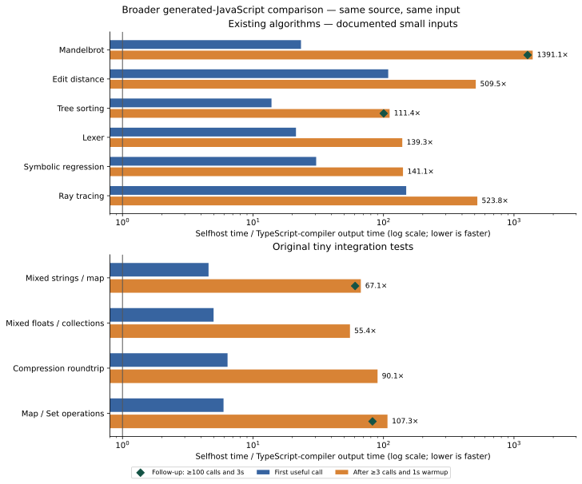

# Phase 28: broader generated-program comparison

The broader suite confirms a serious generated-JavaScript performance gap.
The earlier diagnostic kernels were not an upper bound on that gap. These are
existing upstream programs compiled from the same Bend source by the pinned
TypeScript implementation and the installed compiler written in Bend. This phase
changes no compiler code and promotes no new release.

## Existing algorithms

Times below are milliseconds per complete exported computation, excluding
compilation, module import and process startup. Each entry is the median of five
fresh processes after at least three further calls AND one second of warmup.
The ratio is selfhost time divided by upstream time; larger is slower.

| Program | Upstream output (ms) | Our output (ms) | Slower |
| --- | ---: | ---: | ---: |
| Mandelbrot | 0.0454602 | 63.2416 | 1391.14× |
| Edit distance | 4.95614 | 2525.3 | 509.53× |
| Tree sorting | 0.282673 | 31.4873 | 111.39× |
| Lexer | 1.92733 | 268.508 | 139.32× |
| Symbolic regression | 1.10936 | 156.479 | 141.05× |
| Ray tracing | 34.0571 | 17839.2 | 523.80× |

These are documented small benchmark inputs, with exact source prefixes and
small appended entry points. [Workload definitions](workloads.md) give the actual
work and checksum scope. In particular, Mandelbrot visits the first 256 positions
of a fixed 4096² viewport, twice; it does not render a resized full image. The ray
tracer shades 5,120 pixels but still probes 1,048,576 column positions. Tree sorting
has 256 leaves, edit distance has four 256-symbol pairs, lexing generates 256 lines,
and symbolic regression evaluates 64 candidates plus 32 hill-climb steps.

## Existing mixed tests

These unchanged tests exercise several library features together. Their fixed
inputs are tiny: the compression roundtrip has six elements, and Map/Set mostly
two or three keys. They broaden feature coverage without establishing scaled
application throughput. Each nullary export recomputes its observable result.

| Program | Upstream output (ms) | Our output (ms) | Slower |
| --- | ---: | ---: | ---: |
| Mixed strings / map (`morning`) | 0.00365639 | 0.245185 | 67.06× |
| Mixed floats / collections (`evening`) | 0.00315668 | 0.174723 | 55.35× |
| Compression roundtrip | 0.000595565 | 0.0536374 | 90.06× |
| Map / Set operations | 0.0230392 | 2.47262 | 107.32× |

## Warmup sensitivity and first calls

The original measurements exposed repeated changes between the two halves of
some timed blocks. We retained every sample and prospectively selected all four
flagged cases for a [separate follow-up](../../design/phase28/warmup-followup.md):
at least 100 warmup calls AND three seconds, with the same emitted bytes, arguments,
oracles, resource limits, sample count and calibration target. Selection occurred
after seeing the original results, before the follow-up acquisition.

| Program | Longer-warm upstream (ms) | Longer-warm ours (ms) | Original ratio | Longer-warm ratio |
| --- | ---: | ---: | ---: | ---: |
| Mandelbrot | 0.0455059 | 57.858 | 1391.14× | 1271.44× |
| Tree sorting | 0.267547 | 26.8554 | 111.39× | 100.38× |
| Mixed strings / map (`morning`) | 0.00353637 | 0.214318 | 67.06× | 60.60× |
| Map / Set operations | 0.0221418 | 1.82373 | 107.32× | 82.37× |

The ratios decline, but the large gaps remain. Mandelbrot has no greater-than 10%
half-to-half changes in the follow-up. Tree sorting still has second halves
10.7–14.3% slower in all five selfhost samples. Map/Set changes direction: its
second halves are now 12.7–17.5% faster in all five. Morning retains one 14.5%
faster second half. Thus the follow-up reduces or changes the observed phase
changes without establishing convergence. The original tighter process-to-process
ranges did not by themselves establish stabilized throughput.

Neither warmup rule proves asymptotic steady state. First useful calls tell a
different story, particularly because the upstream output becomes substantially faster
with repetition. These first-call times exclude module import and startup too:

| Program | Upstream output (ms) | Our output (ms) | Slower |
| --- | ---: | ---: | ---: |
| Mandelbrot | 5.80166 | 135.326 | 23.33× |
| Edit distance | 25.3393 | 2754.96 | 108.72× |
| Tree sorting | 5.3124 | 73.6448 | 13.86× |
| Lexer | 20.464 | 436.858 | 21.35× |
| Symbolic regression | 9.37839 | 285.956 | 30.49× |
| Mixed strings / map (`morning`) | 2.20584 | 10.0696 | 4.56× |
| Mixed floats / collections (`evening`) | 2.53505 | 12.649 | 4.99× |
| Compression roundtrip | 0.515878 | 3.29351 | 6.38× |
| Map / Set operations | 5.2824 | 31.4104 | 5.95× |
| Ray tracing | 126.788 | 18931.9 | 149.32× |

## Small interpreter application

The unchanged 1,916-line `demos/pure_hvm5_mini/main.bend` parses and evaluates its
original small embedded program with a 65,536-cell environment. Five fresh runs per
compiler measure the whole process: spawn, Node startup, module loading, computation,
stdout and exit. This is a separate scope from every library timing above.

| Compiler producing the program | Median process (ms) | Observed range (ms) |
| --- | ---: | ---: |
| Pinned TypeScript | 69.210 | 63.872–72.390 |
| Compiler written in Bend | 200.929 | 197.170–201.497 |

Whole-process ratio: **2.903× slower**.

Both outputs print exactly:

```text
&S{#0{()},#1{()}}
- Itrs: 79 interactions
```

The normal form agrees with the source commentary; 79 interactions is a
differential agreement, not an independent oracle. Upstream emits CommonJS and
selfhost ESM; their respective loader costs are included in this process metric.
See the [application notes](applications.md).

## What this establishes

The gap extends to existing numeric, recursive-tree, string-processing and
collection workloads. We should prioritize generated-code quality alongside
semantic coverage. It would be misleading to use the older roughly 3× ordinary
compiler-checking figure to describe these programs' runtime, or to claim the
earlier selected kernels were worst cases. Conversely, this selected suite does
not provide a universal average for production applications, other input sizes,
native C, parallel CPU or GPU execution.

Read-only [emission inspection](emission-findings.md) identifies concrete next
experiments: saturated private calls/loops, guarded primitive inlining, and
direct native constructor/match lowering. Upstream exposes ordinary multi-argument
loops and inline arithmetic where selfhost often uses nested generic calls,
partial descriptors and constructor forcing. Both already have tail-call machinery
and native JavaScript strings. These observed structures motivate ablations;
this comparison does not quantify their individual causal contributions.



## Controls, evidence and retained failures

The reference is upstream 018751270e800bc222a93dad7f257083ee53a5f7, after 2.0.34.
The selfhost image is Phase 27's checked attempt 02: API 5a89c775, checked parent 25c38e3f,
source f3097523, runtime 40823818 and Base c742fae9. Node 24.18.0 runs serially on CPU 3
with a 4 MiB stack, 1 GiB heap and sanitized environment on an Intel Xeon
E3-1245 V2 host. Side order alternates.
Library calibration targets 300 ms with a one-million-call cap; a single expensive call can
exceed that target. Each process has a 120-second deadline. Every invocation checks
the complete scalar or string result inside the timed scope. Published small-input
checksums validate the algorithms' returned summaries, not every internal element.

All **150 timing samples** complete: 100 original library samples, 40 follow-up
library samples and 10 HVM processes. Another 28 fresh checks and 28 calibrations
bring the independently audited total to 206 processes, with no failed or omitted
clean observations. The original ten-library campaign takes 816.11 s
(13m 36s); the four-case follow-up takes 189.32 s (3m 09s).
Acquisition/compilation and report preparation are separate costs. Five samples
per side give observed medians/ranges, not confidence intervals.

The two rejected raytrace wrappers used uninferable local Nat syntax and were
rejected by both compilers. The final wrapper uses `U32.to_nat(6)` with unchanged
algorithm and input. The first HVM upstream launch used the wrong `.mjs` extension
for CommonJS output; retrying the identical bytes as `.cjs` succeeds. All three
failed acquisitions remain preserved rather than being classified as compiler
semantic defects or silently discarded.

[Raw numerical summaries](results.json), the
[independent measurement audit](measurement-audit.md),
[reproduction instructions](README.md) and the [evidence capsule](evidence/README.md)
retain original and follow-up windows separately. All 11 selected programs agree
at their stated observable output. This is additional scoped execution evidence;
it does not renew the whole frontend/backend conformance inventory.

The [closure audit](closure.json) verifies unchanged production/compiler/release
paths and all 103 unrelated starting files. The installed Phase 27 release still
verifies. No new PR comment is posted.
