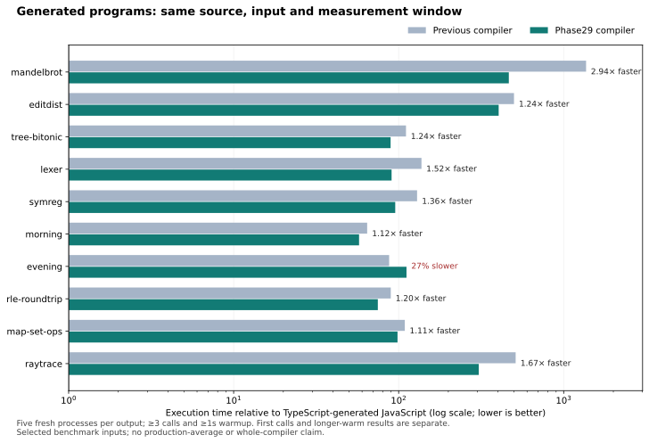

# Phase 29: faster generated JavaScript and a fast experiment loop

## What changed

Two measured costs now have guarded compiler optimizations: saturated native
scalar operations emit JavaScript expressions, and supported Nat countdown
functions execute recursive steps in a private local-slot loop. The public
matcher and partial-function descriptors remain intact. The implementation adds
263 Bend lines and 36 definitions in two modules, with no new datatype, runtime
helper, intermediate representation or calling ABI.

The [design](../../design/phase29/generated-program-fast-loop.md) was committed
before experiments. A separate [worker amendment](../../design/phase29/private-nat-worker.md)
froze its production rule after the disposable prototype supported the mechanism.
The [reproduction guide](README.md), [prototype report](prototype-findings.md),
[integration checks](integration-findings.md) and [semantic review](semantic-review.md)
retain the details and boundaries.

## Original programs: controlled comparison

All six algorithms improve in the original transfer window. Their remaining gaps
are still **89–465× TypeScript output**, so the phase does not close the broader
performance deficit. The table also includes four smaller mixed tests.

The comparison uses five fresh processes per output, rotating serially on CPU 3,
with Node 24.18.0, 4 MiB stack and 1 GiB heap. After a separately recorded first call, each process
warms for at least three further calls AND 1000 ms, then runs a calibrated 300 ms
timed target. Every result is checked. Values are medians in milliseconds per
complete exported call, on exactly the Phase 28 sources and documented inputs.

| Program | TypeScript ms | Previous ms | Phase 29 ms | Speedup | Phase 29 / TS |
| --- | ---: | ---: | ---: | ---: | ---: |
| Mandelbrot | 0.04538 | 62.041 | 21.11 | 2.94× | 465.2× |
| Edit distance | 4.941 | 2,470.3 | 1,994.9 | 1.24× | 403.7× |
| Tree sorting | 0.2807 | 31.096 | 25.085 | 1.24× | 89.4× |
| Lexer | 1.912 | 262.89 | 173.23 | 1.52× | 90.6× |
| Symbolic regression | 1.111 | 143.61 | 105.86 | 1.36× | 95.3× |
| Morning mixed test | 0.003675 | 0.23682 | 0.2115 | 1.12× | 57.6× |
| Evening mixed test | 0.003133 | 0.27429 | 0.34946 | 0.78× | 111.6× |
| RLE round trip | 0.0005969 | 0.053457 | 0.044632 | 1.20× | 74.8× |
| Map/Set operations | 0.0227 | 2.4735 | 2.234 | 1.11× | 98.4× |
| Ray tracing | 34.17 | 17,482 | 10,448 | 1.67× | 305.8× |

**The evening test regresses by 27.4% in this window.** Its median rises from
0.274290 ms to 0.349464 ms. Old timed halves differ by 2.17–2.31× and candidate halves
by 2.18–4.10×. The [prospective follow-up](../../design/phase29/evening-warmup-followup.md)
tests the same bytes with longer warmup; neither its outcome nor other gains erase
this recorded lifecycle cost. Sample ranges and every half remain in `results.json`.

On Mandelbrot, arithmetic alone takes 30.770 ms and the combined compiler takes
21.110 ms in this same window: the worker adds another 1.46× improvement after
arithmetic. The lexer and sorting modules are byte-identical between arithmetic-only
and combined compilers: their small timing differences cannot be a worker gain.
Only Mandelbrot and symbolic regression select a private Nat loop in this broader
corpus. The narrower worker contract deliberately leaves the other programs generic.

The complete three-output campaign, including the arithmetic-only fourth output
on three cases, takes **1322.9 s end to end (22.0 minutes)**. This is an integration
cost, compared with 4.7 s for the small paired screen. It was run once for the final
candidate. The earlier arithmetic-only transfer trial covered only three selected
programs; its separate window remains preserved.

First-call speedup differs from warmed execution; imports are recorded separately:

| Program | Previous first call ms | Phase 29 first call ms | Speedup |
| --- | ---: | ---: | ---: |
| Mandelbrot | 134.45 | 76.727 | 1.75× |
| Edit distance | 2,711.7 | 2,206.1 | 1.23× |
| Tree sorting | 71.3 | 68.996 | 1.03× |
| Lexer | 437.04 | 318.13 | 1.37× |
| Symbolic regression | 281.26 | 221.57 | 1.27× |
| Morning mixed test | 9.9708 | 9.9391 | 1.00× |
| Evening mixed test | 12.6 | 12.367 | 1.02× |
| RLE round trip | 3.2697 | 3.151 | 1.04× |
| Map/Set operations | 31.422 | 30.915 | 1.02× |
| Ray tracing | 18,638 | 11,343 | 1.64× |

These scopes are generated JavaScript execution, not compiler throughput. The host
is an Intel Xeon E3-1245 V2 at 3.40 GHz on Linux x86_64; all our other builds and
generated-program executions were paused during timing. Five samples and observed
ranges do not establish confidence bounds, a production average or universal
steady-state performance. Expensive one-call samples have no second-half estimate.

## Longer warmup and other scopes

The four previously drift-flagged original programs receive the frozen confirmation
protocol: at least 100 calls AND 3000 ms warmup, five fresh samples per output.
This is a separate lifecycle window, not a replacement for the original results.

| Program | TypeScript ms | Previous ms | Phase29 ms | Speedup |
| --- | ---: | ---: | ---: | ---: |
| Mandelbrot | 0.0455514 | 56.4303 | 20.9405 | 2.695× |
| Tree sorting | 0.266234 | 26.4829 | 24.9041 | 1.063× |
| Morning mixed test | 0.003531 | 0.209938 | 0.192555 | 1.090× |
| Map/Set operations | 0.0213727 | 1.71585 | 1.61121 | 1.065× |

Mandelbrot and morning have no greater-than-10% half-drift flag in this window.
Sorting still drifts in all old and candidate samples: second/first-half ratios
are 1.116–1.133 and 1.230–1.295 respectively. Map/Set also retains drift. Thus the
sorting and Map/Set gains remain sensitive to the lifecycle window; additional
warmup has not demonstrated convergence. We retain these results rather than
repeating until a favorable or stable-looking number appears.

The additional evening follow-up takes 65.1 seconds end to end. With longer
warmup, old output takes 0.162918 ms (range 0.156580–0.165210), while Phase29 takes
0.139563 ms (0.138695–0.140301): **1.167× faster**. TypeScript takes 0.003055 ms.
All fifteen timed samples have second/first-half ratios within 2.4% of one;
first-call medians are 12.535 ms old and 12.377 ms new. This supports a lifecycle
sensitivity explanation for the original 27.4% regression, without proving that
JIT tiering is its cause. Both windows remain part of the release decision.

The real compiler membership fixture and the prior substitution/Boolean controls
use the same longer-warm protocol, with unchanged sources and independent oracles:

| Component fixture | TypeScript ms | Previous ms | Phase29 ms | Speedup |
| --- | ---: | ---: | ---: | ---: |
| compiler-membership | 0.0172709 | 0.59343 | 0.571047 | 1.039× |
| term-substitution | 0.0585352 | 2.3255 | 1.80423 | 1.289× |
| boolean-worker | 0.00554986 | 1.93745 | 1.16013 | 1.670× |

The membership wrapper also builds its list and reduces the answer to a checksum.
These component results do not establish a whole-compiler improvement. Upstream
substitution still has three flagged half pairs, and one candidate Boolean sample
has a 1.137× half ratio; the table does not claim full convergence.

The original HVM demo shows **no measured whole-process benefit**: previous
196.86 ms (193.57–203.61), Phase29 198.39 ms (195.42–200.65), TypeScript 68.54 ms
(65.83–69.96), five complete fresh processes each. The old/new ranges overlap;
the new median is 0.78% slower and remains 2.895× TypeScript. This scope includes
spawn, startup, module load, computation, complete stdout and exit. It is never
pooled with warmed exported calls. All complete outputs agree.

## Finding: repeated call machinery obscures small operations

The small fixture preserves real Mandelbrot helpers and adds parameterized entry
points. We compared unchanged output, arithmetic-only, private-loop-only and
combined disposable JavaScript variants, then required the compiler itself to
emit the winning mechanisms. All 120 fixture points have an independent Python
oracle; 192 additional prototype boundary observations compare public partial
calls, descriptor shape and failure stage.

In the longer-warm prototype confirmation, the old fixture takes 1.463 ms/call,
arithmetic-only 0.748 ms, worker-only 1.063 ms and combined 0.395 ms: 1.96×, 1.38× and 3.70×
faster respectively. The short screen suggested 6.40×, but its old output slows
substantially within the timed block. Both windows survive; 6.40× is not presented
as a settled performance result. These interventions identify removable overhead,
not exclusive percentage shares of total execution cost.

Separate instrumentation over ten identical calls records generic applications
falling from 70,540 to 27,030, bound descriptors from 7,730 to 60 and copied argument
slots from 142,430 to 46,500 in the combined prototype. The private loop removes
99.2% of the counted partial descriptors. These are counts at named runtime sites, not a total
heap-allocation census or an instrumented speed claim. Remaining helper/Boolean
dispatch is substantial even after these removals. Instrumenting the actual
compiler-produced fixture separately gives 26,970 applications, 60 bound
descriptors and 46,390 copied slots for the same ten calls. Its extra six inlined
wrapper operations explain the small difference from the disposable prototype.
The [integration report](integration-findings.md) records both sets of counters.

## Iteration cost

The final two-output screen takes **4.706 seconds end to end**, including Python
startup, input identity checks, separate correctness/calibration processes and
six timed processes. The comparison's internal campaign timer is 3.908 seconds;
use the larger figure when budgeting an edit loop. The four-output longer-warm
confirmation takes 84.434 seconds including its launcher.

The corrected checked build and 36 focused observations take 33.341 seconds.
Emitting the small fixture takes another 4.825 seconds including lineage
verification, and its 120-point check takes 0.165 seconds. Those acquisition
steps were recorded during parallel integration work and are descriptive costs,
not comparative compiler throughput. A build + emit + fixture check + short
screen therefore budgets about **43 seconds**, before additional changed-feature
semantic controls. Reuse the checked attempt when only changing fixture inputs;
reuse saved modules for mechanism experiments. Deep integration remains a separate
boundary, including programs where a single call takes many seconds.

The screen is useful for rejecting poor ideas quickly. Confirmation remains
necessary: the same final fixture shows a short-window 6.66× gain but a longer-warm
**3.65×** gain (1.455003→0.398719 ms). All final confirmation halves differ by less
than 10%; this finite stability check does not prove universal steady state.
TypeScript output still takes 0.001703 ms on this input, about 234× faster than
our final output. The successful local optimization does not erase that gap.

## Production rule and correctness

`primitive.bend` recognizes 54 U32/F32 operations only with an identified native
definition, exact saturation, correct live telescope and native scalar owners.
Unsigned arithmetic wraps correctly, multiplication uses `Math.imul`, Nat shift
counts retain their bounds, and F32 arithmetic keeps `Math.fround` boundaries.
Conditional/reused operands are bound once in source order. Partial, foreign,
unknown and unsupported operations use the existing runtime path.

`worker.bend` recognizes a top-level native Nat Zero/Succ matcher with 2–32 live
scalar parameters, supported explicit lambdas, a bounded body and an exactly
saturated self-tail call on the captured predecessor. Let/annotation chains are
supported. The successor callback retains its public arity and partial descriptor;
only fully entered recursion uses local slots. Next arguments evaluate once in
order, parallel lets preserve scope, and fresh immutable aliases protect escaping
closures. Zero executes the original arm. Unsupported shapes retain fallback.

Final API `10510efda268bac1f31cc8fed87a9315e8f9edfa15aad6b90b0d96756c217b11`
comes from checked parent
`37218b8a6f954bd4478502e79359080994c620b66f99d5e324627c8e740b1ea2` through the
existing guarded profile 6 derivative. Runtime 40823818 and upstream 0187512 remain
unchanged. This is a checked B1 lineage, not a new self-hosted fixed point.

The final independent controls include 56,205 primitive scalar/ABI executions,
1,129 primitive guard checks and 25 order/error observations; 3,759 worker scalar
executions and 14 matching descriptor/effect transcripts; 40 worker frontier guards,
two executable let witnesses and 144 nested-Nat regression observations. These
overlapping counts include multiple emitters and must not be summed into a unique
conformance total. The reviewer verifies that eight checked test functions
actually select the new loop; Bool-carried nested match, non-tail and changed
counter examples deliberately retain fallback.

## Failures that changed the implementation

Attempt 02 failed source admission because a locally normalized value preceded a
parameter match in a helper. A separate helper taking the normalized head repairs
the unsupported source shape; the rejected attempt remains preserved.

Attempt 03 passed focused semantics, 23 libraries / 127 points and 15 upstream JS
fixtures, yet overflowed the compiler stack on the original symbolic-regression
and ray-tracing programs. Bend's `&&` is eager: a false shape guard still entered
recursive recognizer checks, including an unsigned `0 - 1` count. Explicit `kc`
branches now fence recursion and decrements; a bounded lambda counter caps work.
A new small regression reproduces the stack overflow on 03 and passes on 04.

The repaired attempt freshly compiles and runs all ten original libraries.
Its output bytes match 03 on all eight previously successful programs and on the
small optimized fixture. This illustrates why focused iteration needs a separate
broad integration gate: a passing subset does not establish safe promotion.

## Complexity and scope

Canonical compiler source is 16,207 physical lines, 13,839 nonblank lines, 612,128
bytes, 1,762 definitions, 640 laws, 68 types and 64 modules. Against Phase 28 this is
+263 physical/+227 nonblank lines, +36 definitions and +2 modules, about 1.65% more
physical lines. This comparable source metric counts the manifest-listed Bend
compiler modules; runtime, experiment tooling, fixtures and documentation are
separate. The two added concepts are guarded scalar-expression lowering
and a private countdown loop. Existing IR, runtime representation and generic
fallback are reused. Compacting explicit branch guards into `&&` would reintroduce
the retained failure; fewer characters would not reduce the required reasoning.

These are JavaScript generated-program improvements. Native/device speed, ordinary
compiler throughput and the full historical frontend inventory were not remeasured.
Successful finite backend controls do not establish full language equivalence or
independent proof validity. Historical Phase 24 frontend equality remains separately
scoped. The [remaining-cost inspection](remaining-costs.md) identifies a concrete next
experiment: a private saturated entry across the edit-distance cell record/tuple
match chain. It keeps projections, constructors and arrays unchanged initially.
Ray tracing and the lexer also retain long generic call/matcher chains. These
static observations do not assign runtime shares; use the new focused loop to
measure that next mechanism before changing global arity or representation.

## Release decision and evidence

Promote checked attempt04. The arithmetic rule transfers to the original algorithms;
the narrow worker adds a further measured Mandelbrot gain. Scoped semantics,
original programs and independent audits pass. There is no persistent longer-warm
regression in the selected cases, but the evening short-window penalty and the
flat HVM process result are explicit tradeoffs. This is useful progress with a
large remaining speed deficit, not a claim that every program or lifecycle improves.

The [measurement audit](measurement-audit.md) independently checks **601 processes
and 429 timed observations** across nine library windows and the whole-process
application comparison. It recomputes statistics, identities, complete results,
rotation and serialized intervals. A separate spot check matches all 344 summary
aggregates in [results.json](results.json). The first combined-audit attempt
incorrectly compared deliberately different warmup policy fields; its failed
receipt and source remain preserved, and the corrected audit compares unchanged
exports, inputs, oracles and modules. No measured sample is discarded or rewritten.

The installed API is the exact checked attempt04 derivative. Release verification
checks its parent, source191df20c, runtime40823818 and upstream0187512 lineage.
Installed CLI controls cover a simple U32 program and the extracted Mandelbrot
fixture with a `main` wrapper; the latter must itself emit the private loop and
inline primitive markers and print the independently expected 128. The first
CLI smoke command combined `-o` with `--run`; this CLI gives output-file emission
precedence, so it emitted correctly but produced no stdout. That failed test
expectation is retained; separate emission and `--run` operations pass.

The [evidence capsule](evidence/README.md) captures raw attempts, failures,
checked/prototype modules, all process logs, exact consumed tools and configs,
audit/release receipts and the old release bytes. Its per-file capture receipt
independently decompresses and checks all 4,322 archived files (83.0 MB logical;
12.2 MB compressed). Phase25/27/28
prerequisites are linked explicitly. The previous release is retained in release
history, and the 103 unrelated starting files are verified byte-identical.

The compiler guide, root README, conformance scope, backend module guide,
experiment ledger and steering document are updated. Designs, implementation,
evidence and reports are published together on the existing fork branch.
