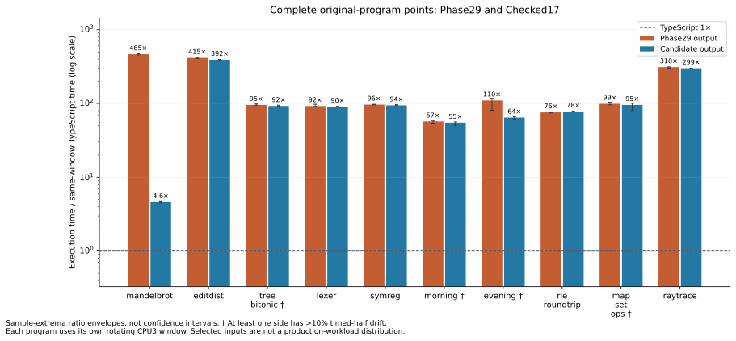
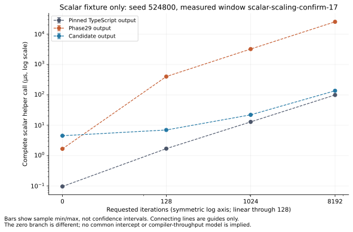

# Checked17 controlled comparison

Status: the frozen 13-job comparative matrix passed all checks in 1530.085
seconds (25 minutes 30 seconds), starting at 15:11:55 UTC on 2026-09-30.
Every declared job and input identity is retained. The separately frozen
tree-bitonic long-warmup diagnostic also passed. This report does not claim installation.

Checked17 integrates exactly the three runtime edits selected by P30-030.
Its compiler API, checked parent and Base are byte-identical to checked16;
runtime bundle `6731308b…` is the measured general registration-flag variant.
The independent `review-registration-correspondence-17/report.json` proves
complete actual-output equality with the retained flag derivatives for RLE,
Mandelbrot, the scalar helper and complete-state row. This is stronger evidence
of transfer than assuming a handwritten diagnostic matches compiler output.

Fresh `transfer-17` acquisition passes all ten original public outputs in
69.71 seconds. The selected 15 upstream observations pass in 43.61 seconds;
the twelve public scalar scaling checks pass in 2.07 seconds. These are
acquisition durations, not comparative compiler performance. Independent
registration transition, public ABI/scalar and entry controls are reported by
their reviewer. The scalar precheck's only runner adaptation changes acquisition
affinity from CPU7 to CPU5; timed scaling remains on CPU3.

`final-timing-batch-plan-17/plan.json` freezes 13 serial jobs and 751 input
identities: ten unchanged original transfer points, ordinary compiler check,
two-source checked-library costs, and four scalar helper sizes. The launcher
derivation in `final-timing-launchers-17` changes only16→17 plan/output labels
and the bound prospective design. Expensive originals retain their 1200-second
outer limits. The complete [checked16 results](final-timing-16.md), figures and
all failed performance expectations remain immutable separate evidence.

`final-figure-plan-17` remains preserved and unexecuted. The fresh17b metadata
binding adds the separate long-tree17 evidence and neutral release status while
retaining the reviewed16c display renderer unchanged. After all timing closed,
its figures were rendered, visually inspected and imported byte-for-byte. See
the [figure report](final17-figures/report.md) and
[copy/visual-review receipt](final17-figures/import.json). The original-program
bars retain the main transfer window; long-window samples remain separate.
No extra long Mandelbrot repetition is scheduled: strict actual17 byte equality
connects it to the already measured flag negative control, while the complete
matrix still includes the unchanged original Mandelbrot transfer point.

## Completed original-program results

The immutable journal is `final-timing-batch-17/report.json`; each job retains
its outer process, full stdout/stderr and individual measurement report. Values
below are median milliseconds per complete public call from the unchanged
same-window transfer protocol, not pooled across compiler attempts.

| Original point | TypeScript | Phase29 | Checked17 | Time change vs29 | Checked17 / TS |
| --- | ---: | ---: | ---: | ---: | ---: |
| Mandelbrot | 0.045950 | 21.379050 | 0.212798 | −99.00% | 4.63× |
| Edit distance | 4.924144 | 2043.843405 | 1927.977556 | −5.67% | 391.54× |
| Tree bitonic | 0.273753 | 26.139551 | 25.255092 | −3.38% | 92.26× |
| Lexer | 1.912223 | 176.105372 | 172.992868 | −1.77% | 90.47× |
| Symbolic regression | 1.101039 | 106.122892 | 103.629737 | −2.35% | 94.12× |
| Morning program | 0.003708 | 0.211189 | 0.203379 | −3.70% | 54.85× |
| Evening program | 0.003161 | 0.346974 | 0.203409 | −41.38% | 64.35× |
| RLE round trip | 0.000592 | 0.044830 | 0.046043 | +2.70% | 77.75× |
| Map/set operations | 0.022467 | 2.224335 | 2.141633 | −3.72% | 95.32× |
| Raytrace | 34.115672 | 10564.198488 | 10202.864968 | −3.42% | 299.07× |

For every sample with two halves, drift is the second-half per-call time divided
by the first-half per-call time, minus one. The table retains the minimum and
maximum observed percentage across all five samples; negative drift means the
sample became faster. These are observed ranges, not confidence intervals.

| Original point | Phase29 half drift | Checked17 half drift | TypeScript half drift |
| --- | ---: | ---: | ---: |
| Mandelbrot | −4.74…−1.11% | −1.00…+0.07% | −2.42…+0.77% |
| Edit distance | single-call samples | single-call samples | −0.70…+0.69% |
| Tree bitonic | −20.58…−15.72% | −16.76…−13.27% | +0.40…+2.72% |
| Lexer | −1.10…+6.65% | +7.05…+7.68% | −0.87…−0.07% |
| Symbolic regression | −1.17…−0.09% | −0.49…+1.18% | −0.21…+0.01% |
| Morning program | −14.25…−12.90% | −13.91…−7.34% | +0.84…+1.91% |
| Evening program | +136.73…+298.54% | −41.65…−40.10% | −3.30…−0.72% |
| RLE round trip | −0.73…+3.37% | −0.84…+0.37% | +0.39…+1.70% |
| Map/set operations | +37.51…+42.17% | +8.72…+49.94% | −1.69…−0.29% |
| Raytrace | single-call samples | single-call samples | −1.35…+0.68% |

Mandelbrot retains 100.47× Phase29 throughput. Candidate range is
0.210200–0.214148 ms, with half drift −1.00…+0.07%; the corresponding Phase29
range is 21.265637–21.603949 ms. The exact output passes. This window is
independent of the P30-030 long negative-control window and does not multiply
its gain into any earlier ratio.

The complete edit-distance program now takes 5.67% less time than Phase29:
candidate 1887.478–1937.527 ms versus Phase29 2021.985–2062.351 ms, with disjoint
ranges. Its exact result passes. The maintained changes also improve this full
original program, consistent with the small-row evidence; this comparison does
not isolate the registration flag's full-program contribution. The remaining
391.54× TypeScript ratio is still large. Array/record representation and generic
runtime costs remain the leading attribution hypothesis, not measured CPU shares. Bend samples
contain one slow call each, so no within-sample half drift is available.

Tree bitonic's transfer-window median is lower, with candidate
25.073330–25.750487 ms versus Phase29 25.904838–26.734608 ms. Both sides still
warm substantially: candidate −13.27…−16.76% and Phase29 −15.72…−20.58% between
sample halves. This is not yet a settled reversal of checked16's separately
measured long-warmup regression. Its exact output passes, and no transfer sample
has been discarded or replaced.

RLE retains a small clear regression against Phase29: 0.045625–0.046234 ms
versus 0.044160–0.044989 ms, with candidate half drift −0.84…+0.37%. The original
point recovers most of checked16's 10.30% regression, while its remaining 2.70%
loss is kept visible. This is consistent with, and separate from, P30-030's
within-window flag improvement over checked16; no cross-window percentage is
substituted for the actual17 observation.

Symbolic regression is 2.35% faster at the median, with narrowly overlapping
ranges and candidate half drift −0.49…+1.18%. Lexer's median is 1.77% lower,
but candidate halves consistently slow by 7.05–7.68%; the small difference
should not be treated as settled throughput. Morning still warms by roughly
7–14%, and evening has opposing extreme transitions: candidate −40…−42%
versus Phase29 +137…+299%. Map/set has overlapping ranges and positive half
drift of roughly 9–50% (candidate) and 38–42% (Phase29). Its apparent median
gain, and especially evening's large apparent gain, do not establish steady
performance improvements. All ten original output checks pass.

Raytrace completes in 673.12 seconds of outer measurement time. Its candidate
range 10175.278–10237.303 ms is below Phase29's 10451.213–10649.647 ms: 3.42%
less time with disjoint ranges. The remaining 299.07× TypeScript ratio is still
large. Like edit distance, its Bend observations are single-call samples, so
within-sample half drift cannot be estimated. This retains the original slow
point without substituting a faster input or declaring a representative average.

## Compiler costs

The ordinary check uses three rotating samples per side on CPU0, separately
from generated-program execution. `final-integration-plan-17/compiler-cost`
passes in 92.79 seconds of outer measurement time. Request medians are
2449.638 ms (TypeScript), 9852.846 ms (Phase29), and 10331.311 ms (checked17):
checked17 costs 4.86% more than Phase29 and 4.22× TypeScript. Whole-process
medians are 3576.840, 11021.335, and 11493.856 ms respectively, a 4.29% increase
over Phase29. Maximum observed RSS is 478116, 758200, and 696240 KiB. Checked17's
compiler API is byte-identical to checked16's; the difference between their
separate timing windows is not evidence that the runtime registration flag
changed compiler-request performance.

The checked-library comparison also uses three rotating samples per side on
CPU0 and preserves host import, request, process and memory costs separately.
`library-cost-17/report.json` passes in 122.54 seconds. These requests compile
the two sources; the values below do not measure execution of their output.

| Library source / cost | TypeScript ms | Phase29 ms | Checked17 ms | Request change vs29 |
| --- | ---: | ---: | ---: | ---: |
| Mandelbrot request | 346.157 | 1631.429 | 1771.079 | +8.56% |
| Mandelbrot whole process | 4848.011 | 6038.152 | 6236.926 | — |
| Edit-distance request | 306.220 | 1547.115 | 1550.356 | +0.21% |
| Edit-distance whole process | 4805.155 | 5942.354 | 6022.987 | — |

The Mandelbrot request regression has disjoint observed ranges:
1759.128–1788.366 ms versus Phase29's 1622.812–1633.578 ms. Its checked17
request is 5.12× TypeScript. Edit-distance request ranges overlap:
1547.678–1588.203 ms versus Phase29's 1532.843–1577.080 ms; checked17 is
5.06× TypeScript. The library process figures include the maintained harness's
full process work and must not be substituted for request-only time. Complete
raw samples, import timing and RSS remain in the immutable report.

## Scalar helper scaling

`scalar-scaling-confirm-17/report.json` passes all four public points in
251.25 seconds of outer measurement time. Each uses the same seed 524800 and
the maintained five-sample confirmation protocol. These are one registered
scalar helper's results, not an average for arbitrary Bend programs.

| Iterations | TypeScript ms | Phase29 ms | Checked17 ms | Phase29 / checked17 | Checked17 / TS |
| --- | ---: | ---: | ---: | ---: | ---: |
| 0 | 0.000096573 | 0.001673869 | 0.004522523 | 0.37× | 46.83× |
| 128 | 0.001699349 | 0.401228477 | 0.006992060 | 57.38× | 4.11× |
| 1024 | 0.012910798 | 3.226702956 | 0.022042052 | 146.39× | 1.71× |
| 8192 | 0.099372493 | 25.477501429 | 0.136688890 | 186.39× | 1.38× |

The checked17 entry guard makes the zero-work call 2.70× more costly than
Phase29. Its cost is amortized as work grows: at 8192 iterations, checked17
is 186.39× faster than Phase29 and 1.376× TypeScript. The candidate's
0.136170–0.137303 ms range is disjoint from both other sides. This does not
remove the generic array/record gap exposed by edit distance and raytrace.

The observed half-drift ranges remain part of the result:

| Iterations | Phase29 half drift | Checked17 half drift | TypeScript half drift |
| --- | ---: | ---: | ---: |
| 0 | +0.91…+1.57% | +1.30…+2.35% | +3.28…+4.88% |
| 128 | -2.80…+0.26% | +0.84…+2.40% | +0.39…+1.43% |
| 1024 | -3.26…-1.94% | -1.84…-0.09% | -1.70…+1.73% |
| 8192 | -1.97…+0.23% | -4.21…-3.35% | -0.52…+0.80% |

In particular, the 8192-point candidate still warms by 3.35–4.21% inside
each sample. The observed 1.376× ratio is reported directly, without treating
it as a perfectly settled asymptote or pooling it with earlier images. All
original-program, ordinary compiler, library compiler and scaling observations
remain distinct windows in the immutable 13-job journal.

## Separate tree-bitonic long-warmup diagnostic

The new-image diagnostic in `final-tree-bitonic-long-confirm-17/report.json`
passes in 195.40 seconds. It preserves the original `bench(8, 0)` input and
971629740 oracle, uses three rotating samples, a 15-second warmup with a
three-call floor, and a one-second target. Its exact rebind from the earlier
long protocol was frozen before measurement; no original transfer sample or
figure bar is replaced.

| Side | Median ms | Observed range ms | Half drift across the three samples |
| --- | ---: | ---: | --- |
| TypeScript | 0.258705 | 0.258577–0.260258 | −0.267%, −1.602%, −0.506% |
| Phase29 | 22.886438 | 22.838760–22.992993 | +0.122%, −0.367%, −0.313% |
| Checked17 | 22.783611 | 22.662344–22.844761 | +1.053%, −1.400%, +1.318% |

Checked17 is 0.45% faster than Phase29 at the median, with overlapping ranges,
and 88.07× TypeScript. This window does not establish a material regression
against Phase29. Checked16's earlier 4.15% long-window loss remains a separate
observation on that earlier runtime; these windows are not pooled or used to
isolate a percentage contribution for the flag. The current-image diagnostic
resolves the main transfer window's substantial warming uncertainty without
claiming a settled speedup from its smaller difference.

## Retained figures

The figures preserve observed sample extrema and mark substantial half drift.
They do not combine the ten selected programs into a production-workload
average. The separate [historical operation-count figure](final17-figures/historical-tree-operation-counts.svg)
retains its actual11→12 label: those named events are neither CPU shares nor
counts for checked17. Installation and CLI validation belong to the separate
[release record](release-17.md).
