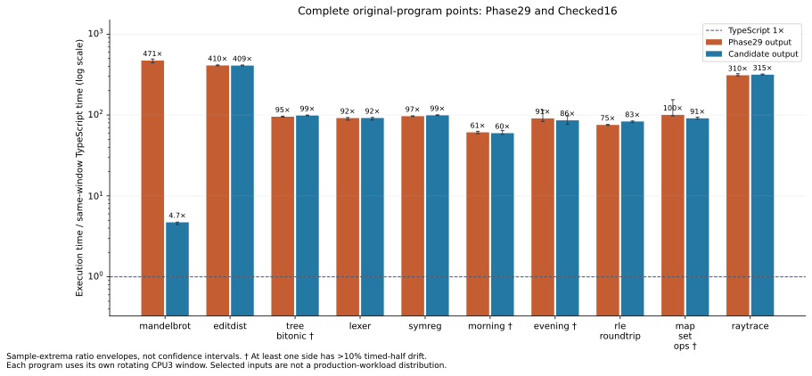
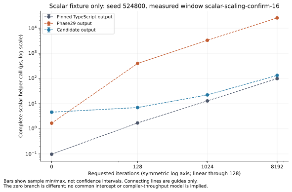
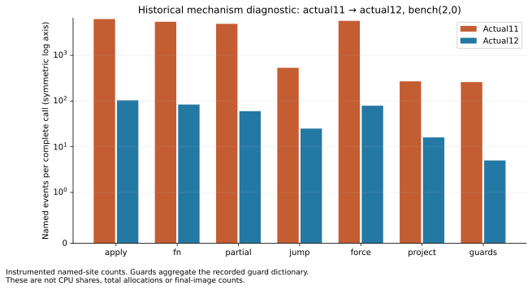

# Retained Phase30 execution figures

Selected compiler: **Checked16**; API `33545640e25beffb61639b27f4815aaeb345fda14758e1d63418cd1d0ccc0637`.

Release status: held candidate pending residual-dispatch investigation and native backend gates; not installed.

Ratios below use only sides measured within the same case/window. Raw sample ranges are not confidence intervals.

| Program | Phase29 ms | Candidate ms | TypeScript ms | Phase29 / candidate | Candidate / TS |
| --- | ---: | ---: | ---: | ---: | ---: |
| mandelbrot | 21.4167 | 0.214181 | 0.0454516 | 99.99× | 4.712× |
| editdist | 2034.07 | 2026.23 | 4.95782 | 1.004× | 408.7× |
| tree-bitonic | 26.0474 | 26.9383 | 0.273253 | 0.9669× | 98.58× |
| lexer | 176.055 | 176.159 | 1.91955 | 0.9994× | 91.77× |
| symreg | 106.988 | 109.779 | 1.10657 | 0.9746× | 99.21× |
| test-morning-program | 0.227457 | 0.222019 | 0.00372316 | 1.024× | 59.63× |
| test-evening-program | 0.286586 | 0.271041 | 0.00315225 | 1.057× | 85.98× |
| test-rle-roundtrip | 0.0447673 | 0.0493763 | 0.000593284 | 0.9067× | 83.23× |
| test-map-set-ops | 2.32856 | 2.1107 | 0.0232002 | 1.103× | 90.98× |
| raytrace | 10609.5 | 10789.5 | 34.2258 | 0.9833× | 315.2× |

Measured helper acquisition image(s): **attempt-16**. The selected-image checked receipt separately proves exact emitted-byte equality.

Helper scaling is a separate source/input scope. Zero follows its real zero branch; the1024→8192 median finite differences are estimates, not a fitted model.

| Side | Estimated ms / added iteration |
| --- | ---: |
| typescript | 1.2057821e-05 |
| phase29 | 0.0031173399 |
| candidate | 1.5442605e-05 |

Historical actual11→12 instrumented named events; not CPU shares or final-image counts.

Full first-call, min/max, timed-half, repetition, import and RSS observations are retained in
[summary.json](summary.json), [summary.csv](summary.csv) and [samples.csv](samples.csv).

Warnings:

- original-program / editdist-timing / editdist / phase29: some timed samples contain only one call; within-sample drift unavailable
- original-program / editdist-timing / editdist / candidate: some timed samples contain only one call; within-sample drift unavailable
- original-program / tree-bitonic-timing / tree-bitonic / phase29: absolute half drift exceeds10%
- original-program / tree-bitonic-timing / tree-bitonic / candidate: absolute half drift exceeds10%
- original-program / test-morning-program-timing / test-morning-program / phase29: absolute half drift exceeds10%
- original-program / test-morning-program-timing / test-morning-program / candidate: absolute half drift exceeds10%
- original-program / test-evening-program-timing / test-evening-program / phase29: absolute half drift exceeds10%
- original-program / test-evening-program-timing / test-evening-program / candidate: absolute half drift exceeds10%
- original-program / test-map-set-ops-timing / test-map-set-ops / phase29: absolute half drift exceeds10%
- original-program / test-map-set-ops-timing / test-map-set-ops / candidate: absolute half drift exceeds10%
- original-program / raytrace-timing / raytrace / phase29: some timed samples contain only one call; within-sample drift unavailable
- original-program / raytrace-timing / raytrace / candidate: some timed samples contain only one call; within-sample drift unavailable
- scalar-helper / scalar-scaling-confirm-16 / scalar-region-0 / candidate: absolute half drift exceeds10%

Separate historical windows (not included in final plots or multiplied into their ratios):

- Held14 transfer: mandelbrot / mandelbrot: `fee9553bc7a10d96bae841c0d4d6ff7a549c3cc7dc5a6c30597c2b1ab15fe39d`.
- Held14 transfer: editdist / editdist: `710952a899721a80331973b69fa5c97606835937f74f74ee03faf80312f8d574`.
- Held14 transfer: tree-bitonic / tree-bitonic: `b8001e18308d196e3b84c80f18f94382064ed0cb9d431438a50ff11d27fc6a09`.
- Held14 transfer: lexer / lexer: `3de1e28f69c498e2847ca7fcb3ed47574d6a5bd531e20ca8a11c2f9b4b251830`.
- Held14 transfer: symreg / symreg: `86a88360edb80baeda1d276895c1de9b1fa47d8f54328283bf29ddcab72fea98`.
- Held14 transfer: test-morning-program / test-morning-program: `46b553678bd1877efdaa56f5df929ac8acef8e9013c6b3b406d7231f2b01a70e`.
- Held14 transfer: test-evening-program / test-evening-program: `906ba05d5768d5d5f99d6ef4bf73ad1660892ce6bd985747218ffe7d96e0970d`.
- Held14 transfer: test-rle-roundtrip / test-rle-roundtrip: `9c6d5845851b8b91d222412d5859c7af31c39a40f9254e42fc6c4d9e85f35ea4`.
- Held14 transfer: test-map-set-ops / test-map-set-ops: `ac7e87255a6d86010876d2f712a00f7490f2f81a00832164f65d1795b749c6ad`.
- Held14 transfer: raytrace / raytrace: `7c17fb85f7849b579c567df87b344d7574eedfd162c646496f87322d25572a10`.
- Seven-way isolated row mechanism / runtime-row32: `d77640af138d08940ff3b8b98e8fd7bcb2627321a0181b91544fafeb9fbdb9b3`.
- Actual15/16 cleanup confirmation / checked-runtime-row32: `5e14ef8e57f0d7ccd1b879b2aae8ecdf4c51d5d6b21180afa015c262c68abd4f`.
- Actual15/16 cleanup confirmation / checked-runtime-scalar128: `5e14ef8e57f0d7ccd1b879b2aae8ecdf4c51d5d6b21180afa015c262c68abd4f`.
- Actual15/16 separate15-second warmup / final-runtime-cleanup-original-mandelbrot: `85d78d8800dad999de38fa52b9bd075b1f89e3c3cd8369c7a343493fee14dd3f`.
- Actual29/16 separate 15-second tree-bitonic follow-up / final16-tree-bitonic-long-warmup: `0a91c5b04fc8b2daee13166c2f54e7de56810a842c24996bbb80916911fe72b0`.
