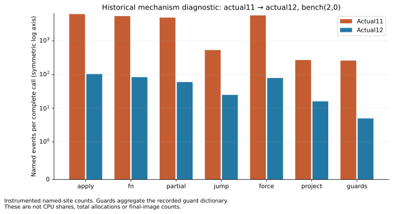

# Retained Phase30 execution figures

Selected compiler: **Checked17**; API `33545640e25beffb61639b27f4815aaeb345fda14758e1d63418cd1d0ccc0637`.

Release status: Measured selected17; installation and CLI validation recorded separately in release-17.md.

Ratios below use only sides measured within the same case/window. Raw sample ranges are not confidence intervals.

| Program | Phase29 ms | Candidate ms | TypeScript ms | Phase29 / candidate | Candidate / TS |
| --- | ---: | ---: | ---: | ---: | ---: |
| mandelbrot | 21.379 | 0.212798 | 0.0459498 | 100.5× | 4.631× |
| editdist | 2043.84 | 1927.98 | 4.92414 | 1.06× | 391.5× |
| tree-bitonic | 26.1396 | 25.2551 | 0.273753 | 1.035× | 92.26× |
| lexer | 176.105 | 172.993 | 1.91222 | 1.018× | 90.47× |
| symreg | 106.123 | 103.63 | 1.10104 | 1.024× | 94.12× |
| test-morning-program | 0.211189 | 0.203379 | 0.00370794 | 1.038× | 54.85× |
| test-evening-program | 0.346974 | 0.203409 | 0.00316088 | 1.706× | 64.35× |
| test-rle-roundtrip | 0.0448301 | 0.0460427 | 0.000592164 | 0.9737× | 77.75× |
| test-map-set-ops | 2.22433 | 2.14163 | 0.0224669 | 1.039× | 95.32× |
| raytrace | 10564.2 | 10202.9 | 34.1157 | 1.035× | 299.1× |

Measured helper acquisition image(s): **attempt-17**. The selected-image checked receipt separately proves exact emitted-byte equality.

Helper scaling is a separate source/input scope. Zero follows its real zero branch; the1024→8192 median finite differences are estimates, not a fitted model.

| Side | Estimated ms / added iteration |
| --- | ---: |
| typescript | 1.2062179e-05 |
| phase29 | 0.0031041851 |
| candidate | 1.5994258e-05 |

Historical actual11→12 instrumented named events; not CPU shares or final-image counts.

Full first-call, min/max, timed-half, repetition, import and RSS observations are retained in
[summary.json](summary.json), [summary.csv](summary.csv) and [samples.csv](samples.csv).

Warnings:

- original-program / editdist-timing / editdist / phase29: some timed samples contain only one call; within-sample drift unavailable
- original-program / editdist-timing / editdist / candidate: some timed samples contain only one call; within-sample drift unavailable
- original-program / tree-bitonic-timing / tree-bitonic / phase29: absolute half drift exceeds10%
- original-program / tree-bitonic-timing / tree-bitonic / candidate: absolute half drift exceeds10%
- original-program / test-morning-program-timing / test-morning-program / phase29: absolute half drift exceeds10%
- original-program / test-morning-program-timing / test-morning-program / candidate: absolute half drift exceeds10%
- original-program / test-evening-program-timing / test-evening-program / phase29: absolute half drift exceeds10%
- original-program / test-evening-program-timing / test-evening-program / candidate: absolute half drift exceeds10%
- original-program / test-map-set-ops-timing / test-map-set-ops / phase29: absolute half drift exceeds10%
- original-program / test-map-set-ops-timing / test-map-set-ops / candidate: absolute half drift exceeds10%
- original-program / raytrace-timing / raytrace / phase29: some timed samples contain only one call; within-sample drift unavailable
- original-program / raytrace-timing / raytrace / candidate: some timed samples contain only one call; within-sample drift unavailable

Separate historical windows (not included in final plots or multiplied into their ratios):

- Held14 transfer: mandelbrot / mandelbrot: `fee9553bc7a10d96bae841c0d4d6ff7a549c3cc7dc5a6c30597c2b1ab15fe39d`.
- Held14 transfer: editdist / editdist: `710952a899721a80331973b69fa5c97606835937f74f74ee03faf80312f8d574`.
- Held14 transfer: tree-bitonic / tree-bitonic: `b8001e18308d196e3b84c80f18f94382064ed0cb9d431438a50ff11d27fc6a09`.
- Held14 transfer: lexer / lexer: `3de1e28f69c498e2847ca7fcb3ed47574d6a5bd531e20ca8a11c2f9b4b251830`.
- Held14 transfer: symreg / symreg: `86a88360edb80baeda1d276895c1de9b1fa47d8f54328283bf29ddcab72fea98`.
- Held14 transfer: test-morning-program / test-morning-program: `46b553678bd1877efdaa56f5df929ac8acef8e9013c6b3b406d7231f2b01a70e`.
- Held14 transfer: test-evening-program / test-evening-program: `906ba05d5768d5d5f99d6ef4bf73ad1660892ce6bd985747218ffe7d96e0970d`.
- Held14 transfer: test-rle-roundtrip / test-rle-roundtrip: `9c6d5845851b8b91d222412d5859c7af31c39a40f9254e42fc6c4d9e85f35ea4`.
- Held14 transfer: test-map-set-ops / test-map-set-ops: `ac7e87255a6d86010876d2f712a00f7490f2f81a00832164f65d1795b749c6ad`.
- Held14 transfer: raytrace / raytrace: `7c17fb85f7849b579c567df87b344d7574eedfd162c646496f87322d25572a10`.
- Seven-way isolated row mechanism / runtime-row32: `d77640af138d08940ff3b8b98e8fd7bcb2627321a0181b91544fafeb9fbdb9b3`.
- Actual15/16 cleanup confirmation / checked-runtime-row32: `5e14ef8e57f0d7ccd1b879b2aae8ecdf4c51d5d6b21180afa015c262c68abd4f`.
- Actual15/16 cleanup confirmation / checked-runtime-scalar128: `5e14ef8e57f0d7ccd1b879b2aae8ecdf4c51d5d6b21180afa015c262c68abd4f`.
- Actual15/16 separate15-second warmup / final-runtime-cleanup-original-mandelbrot: `85d78d8800dad999de38fa52b9bd075b1f89e3c3cd8369c7a343493fee14dd3f`.
- Actual29/16 separate 15-second tree-bitonic follow-up / final16-tree-bitonic-long-warmup: `0a91c5b04fc8b2daee13166c2f54e7de56810a842c24996bbb80916911fe72b0`.
- Prior checked16 transfer: mandelbrot / mandelbrot: `a2ce036f5e2b142d9292cb80ea47ea7996c3c61b969493600d303e89cae3da4b`.
- Prior checked16 transfer: editdist / editdist: `0c8bad60fa376d757ca806bc913f3f12e156641d2e2c042a77215e8c65e4bdaa`.
- Prior checked16 transfer: tree-bitonic / tree-bitonic: `c9e37a3d4beda81b7f29043ca9ff85d4b6365ac2f5be2e505ae1dec4baff3f26`.
- Prior checked16 transfer: lexer / lexer: `5ad152db5b00f3ad480b6c4f6501c927183086c7d0f08b89d17b90a28ceab34a`.
- Prior checked16 transfer: symreg / symreg: `9eaa9f4a34c5256eea830c66ac3af6f0a04f778a4006b91848587c6146eb78c0`.
- Prior checked16 transfer: test-morning-program / test-morning-program: `5e4d620dceb9dece897a081252df95cce6a6e27795d9ec322a8243610c3c695c`.
- Prior checked16 transfer: test-evening-program / test-evening-program: `9646bc66d27c8c51aedf587e7d57a3e076ed6ca037d2e42167555507ff0388b8`.
- Prior checked16 transfer: test-rle-roundtrip / test-rle-roundtrip: `48b97156009d0a5b2e851257bd7e16c35f9eef7753460fac4851bf3c0bb30319`.
- Prior checked16 transfer: test-map-set-ops / test-map-set-ops: `c1b1b1fa58c05ed4b92518d00175f54353e9e6cf2430e2bf7c8d91d69ba0683b`.
- Prior checked16 transfer: raytrace / raytrace: `15bf45558cbc4a93c069600ac50085608d05c8dc9e69ed6058807158141aa066`.
- P30-030 isolated RLE confirmation / registration-rle: `7f076ef8627605a318e6bb76cc0b6f3f5ccdf3d9464ac6a433288ebe49207ba1`.
- P30-030 registered helper negative control / registration-helper128: `a25bdf346f88992052645b9277e43dfc47e04c389a10f2bbc0168b65bf440bb9`.
- P30-030 complete-state row negative control / registration-row32: `a9376432f47874c4b4cd196cb76db2ed24523cb3f1326f77a578a2226fa2891a`.
- P30-030 separate15-second Mandelbrot negative control / registration-original-mandelbrot: `d335843c48bb72f92e64621f1346b94440edf3ee298607db5aa206cecd7fd13c`.
- Checked17 separate15-second-warm tree-bitonic diagnostic / final17-tree-bitonic-long-warmup: `ca7a6314a135d7c91b993fb56c280163794d940fbce14e96a2a8765e6db6baaa`.
