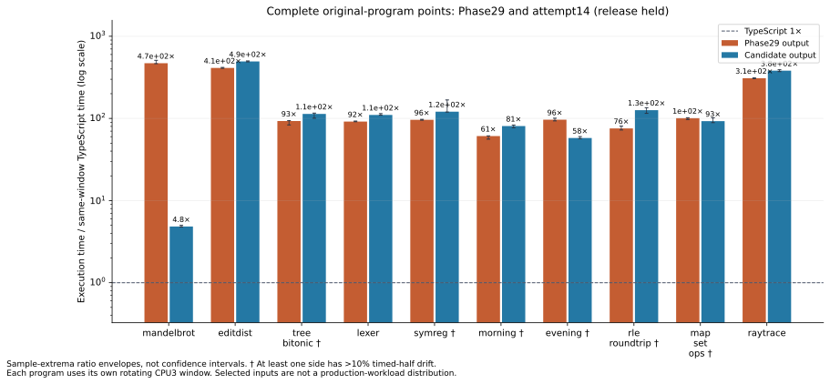
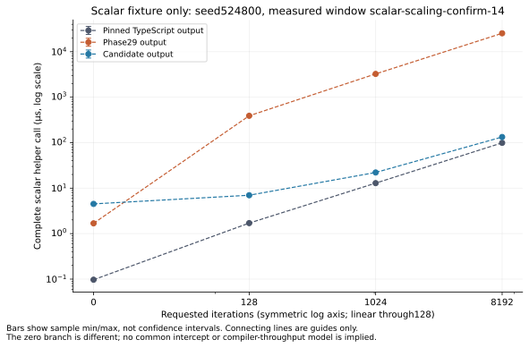
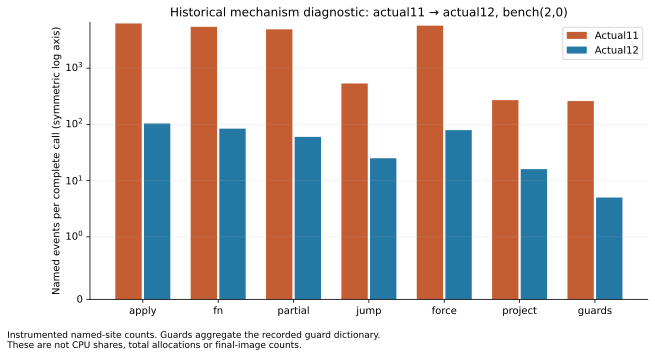

# Retained Phase30 execution figures

Selected compiler: **attempt14 (release held)**; API `ade96ba48b05ba116430f57e433d8fbdbd76646b61f5e9d53cf34a4c4a9da76d`.

Release status: held after generic-path regressions; Phase29 remains installed.

Ratios below use only sides measured within the same case/window. Raw sample ranges are not confidence intervals.

| Program | Phase29 ms | Candidate ms | TypeScript ms | Phase29 / candidate | Candidate / TS |
| --- | ---: | ---: | ---: | ---: | ---: |
| mandelbrot | 21.4737 | 0.220591 | 0.0456867 | 97.35× | 4.828× |
| editdist | 2029.57 | 2435.48 | 4.92933 | 0.8333× | 494.1× |
| tree-bitonic | 26.0973 | 31.8651 | 0.280755 | 0.819× | 113.5× |
| lexer | 175.074 | 210.847 | 1.91248 | 0.8303× | 110.2× |
| symreg | 106.229 | 133.378 | 1.10421 | 0.7964× | 120.8× |
| test-morning-program | 0.224574 | 0.297414 | 0.00368429 | 0.7551× | 80.72× |
| test-evening-program | 0.303579 | 0.181654 | 0.00314635 | 1.671× | 57.74× |
| test-rle-roundtrip | 0.044962 | 0.0750528 | 0.000594965 | 0.5991× | 126.1× |
| test-map-set-ops | 2.22478 | 2.04654 | 0.0220818 | 1.087× | 92.68× |
| raytrace | 10527.9 | 13027.8 | 34.1464 | 0.8081× | 381.5× |

Measured helper acquisition image(s): **attempt-14**. The selected-image checked receipt separately proves exact emitted-byte equality.

Helper scaling is a separate source/input scope. Zero follows its real zero branch; the1024→8192 median finite differences are estimates, not a fitted model.

| Side | Estimated ms / added iteration |
| --- | ---: |
| typescript | 1.2031156e-05 |
| phase29 | 0.0030894851 |
| candidate | 1.5489293e-05 |

Historical actual11→12 instrumented named events; not CPU shares or final-image counts.

Full first-call, min/max, timed-half, repetition, import and RSS observations are retained in
[summary.json](summary.json), [summary.csv](summary.csv) and [samples.csv](samples.csv).

Warnings:

- original-program / editdist-timing / editdist / phase29: some timed samples contain only one call; within-sample drift unavailable
- original-program / editdist-timing / editdist / candidate: some timed samples contain only one call; within-sample drift unavailable
- original-program / tree-bitonic-timing / tree-bitonic / phase29: absolute half drift exceeds10%
- original-program / symreg-timing / symreg / candidate: absolute half drift exceeds10%
- original-program / test-morning-program-timing / test-morning-program / phase29: absolute half drift exceeds10%
- original-program / test-morning-program-timing / test-morning-program / candidate: absolute half drift exceeds10%
- original-program / test-evening-program-timing / test-evening-program / phase29: absolute half drift exceeds10%
- original-program / test-rle-roundtrip-timing / test-rle-roundtrip / phase29: absolute half drift exceeds10%
- original-program / test-rle-roundtrip-timing / test-rle-roundtrip / candidate: absolute half drift exceeds10%
- original-program / test-map-set-ops-timing / test-map-set-ops / phase29: absolute half drift exceeds10%
- original-program / test-map-set-ops-timing / test-map-set-ops / candidate: absolute half drift exceeds10%
- original-program / raytrace-timing / raytrace / phase29: some timed samples contain only one call; within-sample drift unavailable
- original-program / raytrace-timing / raytrace / candidate: some timed samples contain only one call; within-sample drift unavailable
