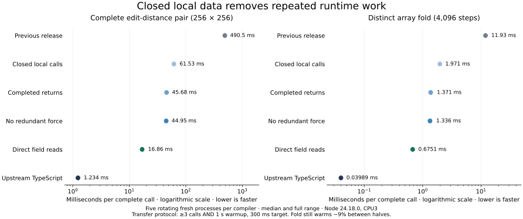

# Closed local data: implementation and measurement

Agent-generated Phase31 report. **Checked07 is installed and verified.** The
original four-pair edit-distance program improves26.83× over the previous release,
with a14.28× remaining TypeScript gap. The implementation adds236 Bend lines
(+1.41%) and preserves all renewed conformance observations.

There are measured costs: generic mixed-module execution is about5% slower,
zero-work scalar entry about4% slower, and edit-distance compilation6.90% slower.
These are explicit tradeoffs, not no-regression passes. This report separates
compiled JavaScript execution, compiler requests and genuine self-emitted
compiler execution. See the [release record](release-07.md) for exact identities,
all42 ordinary/relocated CLI checks and preserved evidence.

## What changed

The existing bounded private-region analyzer now admits closed local Array<U32>,
nonrecursive records and specialized canonical Sigma. Public roots still admit
scalar inputs/results, with the earlier inert flat terminal-record exception.
All internal data must originate in the admitted graph. Original descriptors and
host marker assumptions are checked once before entry; arbitrary public calls
and unsupported shapes retain their ordinary implementation.

The work is split into measured checked compiler ablations:

| Candidate | Single step |
| --- | --- |
| 04 | Close the whole private helper graph, including array setup, nested Nat loops and complete record-pattern prefixes; preserve ordinary builds, forces, project and copy |
| 05 | Complete private helper returns at the demand point already required by their callers |
| 06 | Remove redundant private-result force after verifying every private exit is completed |
| 07 | Read proved private field layouts directly, retaining left-to-right field snapshots and original representations |

The same KTerm carrier and existing traversal, helper-cycle checks, recursion
limits, fuel and loop emitters are reused. `local.bend` defines the additional
bounded type/native proof. New private plan nodes describe native calls and
record unpacking. There is no new public data representation, ownership system,
separate optimizer pipeline, algorithm change or backend substitution.

The proof of fully demanded private returns is deliberately narrow. A private
result is either a non-tail argument/RHS, already demanded before its next
sibling, or a tail result with no intervening source operation before demand.
Callbacks, foreign containers, function fields and escaping delayed work are
excluded. Eagerly moving arbitrary writes across reads remains invalid. The
[proof](../../design/phase31/fully-demanded-private-results.md) and
[direct-field proof](../../design/phase31/direct-private-field-reads.md) preserve
these boundaries and the generic public path.

## Mechanism and correctness evidence

On a complete256×256 edit-distance pair, checked17 performs2,295,886 generic
applications.04 reduces this to1. Its65,792 builds disappear in05;06 reduces
force entries to1;07 removes328,450 generic projections. Constructors, original
array handles and all array storage operations remain. Counts are diagnostic,
not inferred CPU shares or speedups.

All stages preserve4 allocations,262,401 reads and66,561 writes:328,966 native
operations in the same order and on the same physical handles. Independent
BigInt recurrences, full arrays and complete compressed event streams match.
A separate one-array fold checks first-field delayed writes and wraparound;
three further structural fixtures cover nested records, nested Sigma, empty
records, prefix slots and ordered public entry/fallback behavior. The independent
[review](actual-local-data-review.md) separates authored-helper involvement from
independent oracles and identifies every retained artifact.

A useful counterexample rejects an incomplete guard: an Array-free Sigma graph
still needs Array-prototype marker protection. Correct old/new code returns209
under the observation; a deliberately weakened guard returns9. Guarding only
calls to Array natives was insufficient. Public raw, forged, constructed, saved
and partially applied functions retain their original observations.

## Controlled comparisons

The [figure receipt](figures/receipt.json) binds the existing raw measurements;
rendering adds no timing samples. Error bars are full sample ranges.

The initial setup-heavy one-row experiment measured3.44–3.99× from closing setup,
then another8–9% less time from a Dp shell experiment. The complete pair shows why
that small probe cannot stand in for the program: initialization happens once,
while the program executes65,536 cells. The first full-pair window measured
checked04 at61.980ms, checked17 at489.298ms, pinnedTypeScript at1.235826ms:
7.89× faster than17, still50.15×TypeScript. Its sampled ranges were disjoint and
actual04 within-sample half drift ranged−0.21% to+1.60%.

The subsequent window compares17,04,05,06,07 and pinnedTypeScript together, on
both that full pair and the distinct4096-step fold. All use exact same-source
checked artifacts, ordinary input/result checks and serial rotating fresh
processes on CPU3. The unchanged transfer protocol uses five samples, at least
three calls and1second warmup, then a300ms timed target. Every result is checked.
Full original four-pair edit distance, Mandelbrot, RLE and ordinary compiler
request cost have separately frozen transfer plans. Their measurements are not
silently inferred from the pair. The [closed ablation](local-data-ablation.md) reports these milliseconds per call:

| Actual compiler | Full pair | Distinct fold |
| --- | ---: | ---: |
| Previous checked17 | 490.483 | 11.930 |
| 04: closed helper graph | 61.529 | 1.971 |
| 05: fully demanded returns | 45.676 | 1.371 |
| 06: redundant force removed | 44.954 | 1.336 |
| 07: direct field reads | **16.859** | **0.675** |
| Pinned TypeScript | 1.234 | 0.03989 |

Final07 is **29.09× faster** on the pair and **17.67× faster** on the fold,
with remaining TypeScript ratios **13.66×** and **16.92×**. These are generated
program times, not compiler throughput. The force-removal increment overlaps
its predecessor's ranges: retain it for the simpler completed-value invariant,
not a demonstrated extra speedup. Field reads give the largest new increment,
removing 62.50% and 49.46% of06 time. The fold still warms by about9% between
halves; report the fixed protocol instead of claiming steady-state convergence.

Longer regression canaries resolve a real cost: zero-work scalar entry is4.01%
slower (about0.18 microseconds), and the generic complete row is5.04% slower.
The scalar8192 ranges overlap. The row does not use the private region, but
shares its module with newly registered optimized roots. The separate frozen
[registration experiment](generic-registration-diagnostic.md) reproduces96.97%
of the same-window row excess by adding one unused exact worker to17. Its
0.447108ms overlaps07's0.447867ms; ordinary17 is0.422862ms. This isolates the
module-wide registry lookup, not the private record algorithm.

The root selects07 **with these measured regressions**, under an explicit
[admission amendment](../../design/phase31/admission-tradeoff.md), after the
completed scoped integration/release gates. P31-002's original no-regression condition
failed and remains failed. The measured29×/17.7× benefits justify this bounded
tradeoff; no unsafe guard removal or descriptor ABI expansion is introduced to
hide the cost. Scalar-zero overhead is separate and was not attributed by the
registration experiment. Earlier screens and all frozen plans remain intact.

## Original-program transfer

The original four-pair edit-distance benchmark includes sequence generation,
all four256×256 comparisons, allocation and checksum combination. With the same
original `bench(2,0)` input and result2065873279, it takes **70.817ms** on07,
**1,900.375ms** on17 and **4.95995ms** on pinned TypeScript. That is **26.83×
faster than17**, with a **14.28× TypeScript gap**. All five sample ranges are
retained;07 spans67.314–71.742ms versus17's1,895.98–1,918.32ms. First-call
medians are107.51ms,2,119.06ms and25.67ms respectively.

The original Mandelbrot point takes0.203686ms on07,0.212826ms on17 and
0.045421ms on TypeScript, a4.484× remaining ratio. Its4.29% median improvement
is an overall candidate comparison, not a separately isolated local-data effect.
The small original RLE control takes0.045167ms on07 versus0.046524ms on17 and
0.0005964ms on TypeScript:2.92% less time, still75.73×TypeScript. Its disjoint
ranges show that the mixed-module row regression is not universal to generic
programs. These three programs are the preselected transfer subset; the other
original programs have no fresh Phase31 timing.

| Original program | Previous17 ms | Final07 ms | TypeScript ms |07 / TypeScript |
| --- | ---: | ---: | ---: | ---: |
| Edit distance, four full pairs | 1,900.375 | **70.817** | 4.95995 | **14.28×** |
| Mandelbrot | 0.212826 | 0.203686 | 0.045421 | 4.48× |
| RLE round trip | 0.046524 | 0.045167 | 0.0005964 | 75.73× |

Five rotating fresh processes per compiler, unchanged transfer protocol and
exact results on every call. Edit-distance07 has five timed calls per sample
and2.72–4.24% slower second halves;17 has one timed call per sample, so no
half-drift estimate. One Mandel17 sample warms9.06%; one RLE TypeScript sample
slows7.53%. These caveats prevent a universal/converged-throughput claim. The
[measurement audit](measurement-summary.json)
retains45 timed observations and18 compilation output hashes. Ordinary
compilation cost is measured separately below.

## Compilation cost and the iteration loop

The unchanged normal checked-library protocol runs three rotated fresh samples
per compiler/source,18 children total on exclusive CPU0. All full output hashes
match their independently acquired reference. It includes the existing checked
Base pipeline; no type-check bypass or emission-only entry is timed. The
[raw report](../../selfhost/build/phase31/final-plan-07/compiler-cost/report.json)
retains host import, request, process and peak memory separately.

| Source |17 request ms |07 request ms | TypeScript request ms |07 /17 |07 / TypeScript |
| --- | ---: | ---: | ---: | ---: | ---: |
| Mandelbrot |1,777.163 |1,790.128 |340.456 |+0.73% |5.26× |
| Edit distance |1,562.096 |1,669.866 |314.330 |+6.90% |5.31× |

Mandelbrot request ranges overlap; the small median difference is unresolved.
Edit-distance compilation is measurably slower with disjoint ranges, adding
about108ms to produce code that saves about1,830ms per four-pair execution.
That arithmetic describes these measured workloads; it is not an application
break-even guarantee including all startup/warmup conditions. This additional
compiler cost is explicitly accepted in selecting07. No compiler-throughput
improvement is claimed.

Host import plus request medians are1,805.712ms/1,685.218ms on07 versus
610.789ms/582.463ms on TypeScript (2.96×/2.89×). Host-import boundaries differ:
Bend API loading stays in its request, while TypeScript's explicit module import
is outside its request. Both boundaries are shown rather than choosing only
the more favorable ratio. Supervised child medians are6.399s/6.286s on07,
+0.21%/+2.20% versus17; these include Node startup, identity preflight, output
persistence and postflight, and are not ordinary CLI throughput. Peak RSS
medians are502,504/501,040KiB, about0.10%/0.35% above17.

The checked05–07 builds plus36 focused observations each took about38 seconds;
these overlapped some other correctness work and are descriptive acquisition
costs, not controlled build speedups. Initial saved-JavaScript controls take
under a second; short screens take seconds and the retained long confirmations
take roughly one to three minutes. Full frontend/backend/release checks are
integration gates. Keep their cost outside each hypothesis loop.

## Lessons from the compiler investigation

Zig's history offers useful methodology: measure a concrete representation or
pipeline boundary, distinguish startup from incremental work, and distinguish
compiler speed from generated-code quality. Its compact token/AST/ZIR work,
self-hosting migration and newer native backend address different costs. See
[the primary-source study](../../design/phase31/zig-lessons.md); its published
multipliers are not predictions for Bend.

Here, [H17 request attribution](h-attribution.md) puts about97% of diagnostic
request time inside generated invocation, with encoding around1% and immediate
view decoding much smaller. The [checker CPU profile](h-checker-profile.md)
then points to application, forcing and matcher machinery. This rules out an
ABI-cache detour as the leading explanation for this workload. Lazy view work,
tracing overhead and sample limitations are retained. No H07 performance or
incremental-checking speedup is claimed by these generated-program results.

The compiler-theory interpretation is selective specialization behind a public
wrapper, demand analysis for private results, and elimination of repeated
representation operations under known layouts. The important invariant is the
closed graph: one checked boundary makes many generic operations unnecessary.
We did not add an SSA pipeline, global alias analysis or an interner because
these experiments did not require them. Zig's compact representations and
incremental dependency tracking remain useful future hypotheses, with separate
compiler-latency measurements needed before integration.

## Failures and limits retained

01–03 are not usable candidates: a guard omission was fixed by02, then execution
exposed root's failure to regenerate the edited runtime fragments into the
embedded bundle.04 rebuilds that bundle before checked acquisition. The36
focused frontend tests alone did not detect this packaging failure.

07's first owner state-observer failed because it looked for a generic project
that the optimization had removed. A declared observer amendment uses physical
allocation handles plus the exact final read; program artifacts remain unchanged.
The independent physical-handle observer needed no such amendment. Failed tools,
syntax/identity checks and old consumed versions are preserved.

The H profiler exceeded its prospective40MB raw artifact cap:53.6MB of call-tree
metadata. Its exact bytes were verified and retained as1.875MB gzip; no samples
were selected or discarded. Existing Phase30 evidence remains recoverable;
only independently verified redundant live synthetic books were reclaimed.

This phase does not establish universal backend equivalence, native/device speed,
a new compiler fixed point or a production-average speedup. Broader historical
JavaScript coverage, recursive data/callback optimizations and actual H throughput
remain distinct work. Fresh3026+196 frontend observations agree exactly; the81-row backend pilot
preserves69 passes /8 not applicable /4 shared failures, using an explicitly
recorded native-context retry. All inherited/additional controls and42 installed
CLI checks pass. The [final conformance report](final-conformance.md),
[independent review](independent-release-review.md) and [release record](release-07.md)
keep their exact scopes and failures visible.

## Complexity

The immutable07 manifest contains **17,014 physical /14,529 nonblank Bend lines**,
1,878 definitions,640 laws,70 types in66 modules (660,570 bytes). Relative to17,
that is236 lines (+1.41%),34 definitions and one module; no new record/type
declarations. The maintained runtime core adds11 lines, reaching245. These
counts exclude generated images, documentation, experiment tooling and evidence.
The [exact count](complexity.json) binds the
snapshot and each source hash.

The conceptual additions are a bounded local-type proof, two private plan tags
(native call and unpack), and a runtime guard extension. Existing graph analysis,
loop lowering, scope machinery, public representations and fallback are reused.
This phase improves speed with modest source growth; it is not a line reduction.

## Consolidation

The maintained release is installed; its previous default remains in history.
All42 ordinary/relocated checks pass. The [durable capsule](evidence/README.md)
preserves22,095 raw files, including failures, and verifies every archived member.
The [README](../../README.md) and compiler/performance/architecture guides link
the new report and explain its guarded scope. All103 unrelated starting files
remain protected. No PR comment was posted.
